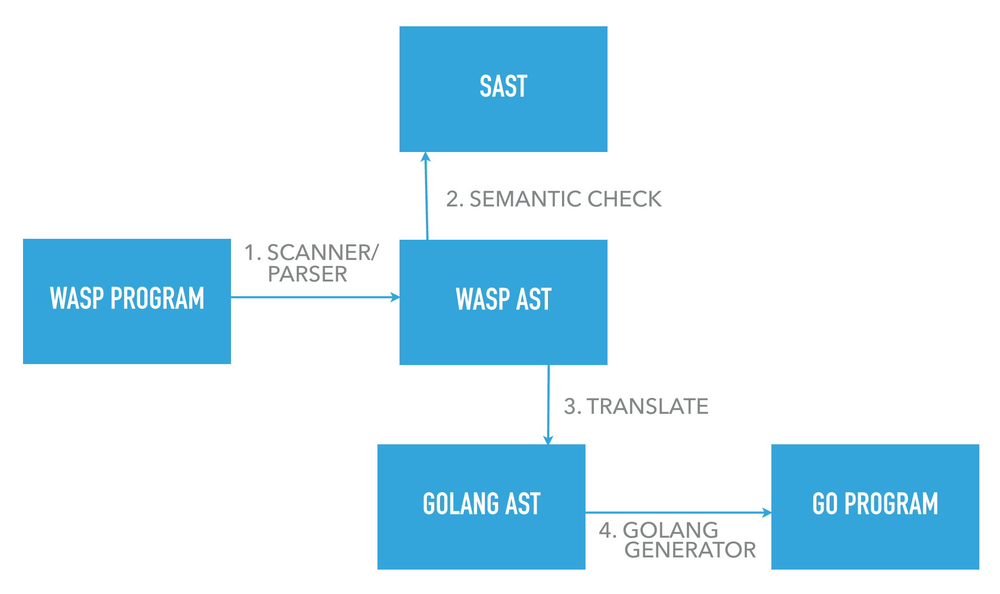

<div style="background-color:white; color:white; padding:40px;"></div> 

# The WASP Language

Dustin Burge, John Chung, Tingting Li, Neel Vadoothker

<div style="page-break-after: always;"></div>

<!-- TOC depthFrom:1 depthTo:6 withLinks:1 updateOnSave:1 orderedList:0 -->

- [The WASP Language](#the-wasp-language)
	- [1 Introduction](#1-introduction)
	- [2 Language Tutorial](#2-language-tutorial)
		- [2.1 Environment](#21-environment)
		- [2.2 Compiling and Running WASP](#22-compiling-and-running-wasp)
		- [2.3 Key Features of WASP](#23-key-features-of-wasp)
		- [2.4 WASP Examples](#24-wasp-examples)
	- [3 Language Reference Manual](#3-language-reference-manual)
		- [3.1 Lexical Conventions](#31-lexical-conventions)
		- [3.1.1 Tokens](#311-tokens)
		- [3.1.2 Comment](#312-comment)
		- [3.1.3 Identifiers](#313-identifiers)
		- [3.1.4 Keywords](#314-keywords)
		- [3.1.5 Constants](#315-constants)
	- [3.2 Meaning of Identifiers](#32-meaning-of-identifiers)
		- [3.2.1 Basic Types](#321-basic-types)
			- [Strings](#strings)
			- [Integers](#integers)
			- [Floating Point Numbers](#floating-point-numbers)
			- [Booleans](#booleans)
		- [3.2.2 Derived types](#322-derived-types)
			- [Object](#object)
			- [List](#list)
			- [Range](#range)
	- [3.3 Objects and Lvalues](#33-objects-and-lvalues)
	- [3.4 Conversions](#34-conversions)
		- [3.4.1 Integer and Floating](#341-integer-and-floating)
		- [3.4.2 Floating Types](#342-floating-types)
		- [3.4.3 Arithmetic Conversions](#343-arithmetic-conversions)
	- [3.5 Expressions](#35-expressions)
		- [3.5.1 Operator Precedence](#351-operator-precedence)
		- [3.5.2 Primary Expressions](#352-primary-expressions)
			- [3.5.2.1 identifier](#3521-identifier)
			- [3.5.2.2 literals](#3522-literals)
			- [3.5.2.3 (expression)](#3523-expression)
			- [3.5.3 primary-expression(expression-list)](#353-primary-expressionexpression-list)
			- [3.5.4 primary-expression[expression-list]](#354-primary-expressionexpression-list)
		- [3.5.5 Unary Operators](#355-unary-operators)
			- [3.5.5.1 `not` expression](#3551-not-expression)
				- [3.5.5.2 `-` expression](#3552-expression)
				- [3.5.5.3 `cap` expression](#3553-cap-expression)
				- [3.5.5.4 `low` expression](#3554-low-expression)
				- [3.5.5.4 `sizeof` expression](#3554-sizeof-expression)
		- [3.5.6 Binary Operators](#356-binary-operators)
			- [3.5.6.1 `expression + expression`:](#3561-expression-expression)
			- [3.5.6.2 `expression .+ expression`:](#3562-expression-expression)
			- [3.5.6.3 `expression - expression`:](#3563-expression-expression)
			- [3.5.6.4 `expression .- expression`:](#3564-expression-expression)
			- [3.5.6.5 `expression * expression`:](#3565-expression-expression)
			- [3.5.6.6 `expression .* expression`:](#3566-expression-expression)
			- [3.5.6.7 `expression / expression`:](#3567-expression-expression)
			- [3.5.6.8 `expression ./ expression`:](#3568-expression-expression)
			- [3.5.6.9 `expression mod expression`:](#3569-expression-mod-expression)
			- [3.5.6.10 `expression and expression`:](#35610-expression-and-expression)
			- [3.5.6.11 `expression or expression`:](#35611-expression-or-expression)
			- [3.5.6.12 `expression xor expression`:](#35612-expression-xor-expression)
			- [3.5.6.13 `expression > expression`:](#35613-expression-expression)
			- [3.5.6.14 `expression >= expression`:](#35614-expression-expression)
			- [3.5.6.15 `expression < expression`:](#35615-expression-expression)
			- [3.5.6.16 `expression <= expression`:](#35616-expression-expression)
			- [3.5.6.17 `expression == expression`:](#35617-expression-expression)
			- [3.5.6.18 `expression != expression`:](#35618-expression-expression)
			- [3.5.6.19 `expression ~= expression`:](#35619-expression-expression)
			- [3.5.6.20 `expression ^ expression`:](#35620-expression-expression)
			- [3.5.6.21 `expression ++ expression`:](#35621-expression-expression)
			- [3.5.6.22 `expression @ expression`:](#35622-expression-expression)
			- [3.5.6.23 `expression -> expression`:](#35623-expression-expression)
		- [3.5.7 Assignment Operators](#357-assignment-operators)
		- [3.5.8 Multiplicative Operators](#358-multiplicative-operators)
		- [3.5.9 Additive Operators](#359-additive-operators)
		- [3.5.10 Other Binary Operators](#3510-other-binary-operators)
		- [3.5.11 Equality and Relational Operators](#3511-equality-and-relational-operators)
		- [3.5.12 Logical AND Operator](#3512-logical-and-operator)
		- [3.5.13 Logical OR Operator](#3513-logical-or-operator)
		- [3.5.14 Logical XOR Operator](#3514-logical-xor-operator)
		- [3.5.15 Assignment Expressions](#3515-assignment-expressions)
		- [3.5.16 Comma Operator](#3516-comma-operator)
		- [3.5.17 Constant Expressions](#3517-constant-expressions)
	- [3.6 Declarations](#36-declarations)
		- [3.6.1 Type Specifiers](#361-type-specifiers)
		- [3.6.2 Declarators](#362-declarators)
		- [3.6.3 Type Equivalence](#363-type-equivalence)
	- [3.7 Statements](#37-statements)
		- [3.7.1 Expression Statement](#371-expression-statement)
		- [3.7.2 Iteration Statement](#372-iteration-statement)
		- [3.7.3 Selection Statements](#373-selection-statements)
	- [3.8 Declarations](#38-declarations)
		- [3.8.1 Function Definitions](#381-function-definitions)
	- [3.9 Scope Rules](#39-scope-rules)
	- [3.10 Grammar](#310-grammar)
	- [4 Project Plan](#4-project-plan)
	- [4.1 Project Management](#41-project-management)
		- [4.1.1 Planning](#411-planning)
		- [4.1.2 Specification](#412-specification)
		- [4.1.3 Development](#413-development)
		- [4.1.4 Testing](#414-testing)
	- [4.2 Project Timeline](#42-project-timeline)
	- [4.3 Roles and Responsibilities](#43-roles-and-responsibilities)
	- [4.4 Software Development Environment](#44-software-development-environment)
	- [5 Language Evolution](#5-language-evolution)
		- [5.1 Database backing](#51-database-backing)
	- [6 Architectural Design](#6-architectural-design)
		- [6.1 The Compiler](#61-the-compiler)
		- [6.1.1 The Scanner](#611-the-scanner)
		- [6.1.2 The Parser](#612-the-parser)
		- [6.1.3 The Semantic Checker](#613-the-semantic-checker)
			- [6.1.3.1 Function Return](#6131-function-return)
			- [6.1.3.2 Type Checking](#6132-type-checking)
			- [6.1.3.3 Symbol Table](#6133-symbol-table)
		- [6.1.4 The Translator](#614-the-translator)
		- [6.1.5 The Golang Generator](#615-the-golang-generator)
		- [6.2 Go Dependencies/Casting Functions](#62-go-dependenciescasting-functions)
			- [github.com/gin-gonic/gin](#githubcomgin-gonicgin)
			- [github.com/go-sql-driver/mysql](#githubcomgo-sql-drivermysql)
			- [gopkg.in/gorp.v1](#gopkgingorpv1)
	- [7 Testing](#7-testing)
	- [7.1 Test Suite](#71-test-suite)
	- [7.2 Test Strategy](#72-test-strategy)
	- [8 Lessons Learned](#8-lessons-learned)
		- [Dustin Burge](#dustin-burge)
		- [Neel Vadoothker](#neel-vadoothker)
		- [Tingting Li](#tingting-li)
		- [John Chung](#john-chung)
	- [9 Full Code Listing](#9-full-code-listing)
		- [scanner.mll](#scannermll)
		- [parser.mly](#parsermly)
		- [ast.mli](#astmli)
		- [ast_printer.ml](#astprinterml)
		- [semantic_check.ml](#semanticcheckml)
		- [type_checking.ml](#typecheckingml)
		- [symbol_table.ml](#symboltableml)
		- [sast.mli](#sastmli)
		- [sast_printer.ml](#sastprinterml)
		- [translate.ml](#translateml)
		- [gast.mli](#gastmli)
		- [gast_printer.ml](#gastprinterml)
		- [wasp.ml](#waspml)
		- [Makefile](#makefile)
- [YACC = menhir --explain](#yacc-menhir-explain)
- [Generated by ocamldep *.mll *.mli *.ml](#generated-by-ocamldep-mll-mli-ml)
		- [test_all.sh](#testallsh)
- [!/bin/bash](#binbash)
	- [Tests](#tests)
		- [tests/compiler/binops_importmathtwice.wasp](#testscompilerbinopsimportmathtwicewasp)
		- [tests/compiler/binops_intdividefloat.wasp](#testscompilerbinopsintdividefloatwasp)
		- [tests/compiler/binops_intdotdividefloat.wasp](#testscompilerbinopsintdotdividefloatwasp)
		- [tests/compiler/binops_multi.wasp](#testscompilerbinopsmultiwasp)
		- [tests/compiler/bool_ops.wasp](#testscompilerboolopswasp)
		- [tests/compiler/boolean_not.wasp](#testscompilerbooleannotwasp)
		- [tests/compiler/comments.wasp](#testscompilercommentswasp)
		- [tests/compiler/ftoc.wasp](#testscompilerftocwasp)
		- [tests/compiler/func_list_access.wasp](#testscompilerfunclistaccesswasp)
		- [tests/compiler/func_types.wasp](#testscompilerfunctypeswasp)
		- [tests/compiler/global_list_access.wasp](#testscompilergloballistaccesswasp)
		- [tests/compiler/global_var.wasp](#testscompilerglobalvarwasp)
		- [tests/compiler/list_checking.wasp](#testscompilerlistcheckingwasp)
		- [tests/compiler/negatives.wasp](#testscompilernegativeswasp)
		- [tests/compiler/string_add.wasp](#testscompilerstringaddwasp)
		- [tests/compiler/test_binops.wasp](#testscompilertestbinopswasp)
		- [tests/compiler/while.wasp](#testscompilerwhilewasp)
		- [tests/go_tests/addint.wasp](#testsgotestsaddintwasp)
		- [tests/go_tests/crud.wasp](#testsgotestscrudwasp)
		- [tests/go_tests/crudandget.wasp](#testsgotestscrudandgetwasp)
		- [tests/go_tests/custom_object_function.wasp](#testsgotestscustomobjectfunctionwasp)
		- [tests/go_tests/deepif.wasp](#testsgotestsdeepifwasp)
		- [tests/go_tests/divideint.wasp](#testsgotestsdivideintwasp)
		- [tests/go_tests/functions_any_order.wasp](#testsgotestsfunctionsanyorderwasp)
		- [tests/go_tests/funkycaps.wasp](#testsgotestsfunkycapswasp)
		- [tests/go_tests/gcd_args.wasp](#testsgotestsgcdargswasp)
		- [tests/go_tests/gcd_noargs.wasp](#testsgotestsgcdnoargswasp)
		- [tests/go_tests/global_var.wasp](#testsgotestsglobalvarwasp)
		- [tests/go_tests/hello_world.wasp](#testsgotestshelloworldwasp)
		- [tests/go_tests/ifelse.wasp](#testsgotestsifelsewasp)
		- [tests/go_tests/listreverse.wasp](#testsgotestslistreversewasp)
		- [tests/go_tests/multint.wasp](#testsgotestsmultintwasp)
		- [tests/go_tests/rangetest.wasp](#testsgotestsrangetestwasp)
		- [tests/go_tests/stringreverse.wasp](#testsgotestsstringreversewasp)
		- [tests/go_tests/twocrud.wasp](#testsgoteststwocrudwasp)
		- [tests/go_tests/var_types.wasp](#testsgotestsvartypeswasp)

<!-- /TOC -->

## 1 Introduction

The WASP language aims to easily and quickly build RESTful ("REST" is short for Representational State Transfer) APIs.
WASP stands for Web API Specification Protocol. It’s a way of describing RESTful APIs in a way that’s highly readable by both humans and computers. WASP focuses on cleanly describing resources, methods, parameters, responses and other HTTP constructs that form the basis for modern APIs that obey the RESTful constraints. It is meant to be simple enough that a
single object definition is enough to create a RESTful backend for that object.

There are two primary use cases for employing WASP. The first is for creating simple RESTful APIs for CRUD (Create, Retrieve, Update, Delete) operations on custom objects. The second is for creating simple calculation based APIs (eg. days until, unit converter, etc.). It is these two use cases that inspired the language and will drive the evolution of WASP throughout its development.
Using WASP to implement a RESTful API is meant to be as simple as defining a struct in C. The details of implementing request routing, object storage, handling HTTP status codes, etc. are
abstracted in favor of the quickest and simplest path to deployment. WASP will be compiled to Go because of its robust built­in networking libraries and the ease of deploying Go server applications

## 2 Language Tutorial

### 2.1 Environment

Since WASP uses the Go programming language ("Go") as its intermediate representation, we need to install Go (https://golang.org/doc/install). Also, the Go intermediate representation uses an HTTP web framework and a MySQL driver for Go's generic interface around SQL databases; so, we will need to install relevant third party Go packages, MySQL and a web server or a stack to run dynamic web sites (e.g. XAMPP, MAMP, WAMP).
Once Go is installed and the GOPATH (https://golang.org/doc/code.html#GOPATH) is set, install the Gin/Gorp, and MySQL third party Go packages.

```
go get github.com/gin-gonic/gin
go get github.com/coopernurse/gorp
go get github.com/go-sql-driver/mysql
```

Before compiling WASP and running Go executables, run the MySQL server. The MySQL port _must_ be set to **8889** for connections to localhost. WASP allows the user to designate the desired TCP port (see section 2.2 below) as long as the default port (e.g. port 80) is avoided. Now, we are ready to use WASP.

### 2.2 Compiling and Running WASP

From the src folder, type `make`. This will create the WASP to Go compiler (wasp executable), which will output Go to standard output given a `.wasp` file. To generate and run the Go executable, type the following:

```
./wasp -g $FILENAME.wasp > $FILENAME.go
PORT = $DESIRED_TCP_PORT go run $FILENAME.go

Specific example:

./wasp -g helloworld.wasp > helloworld.go
PORT = 8080 go run helloworld.go
```
When selecting a TCP port, avoid selecting the default port (e.g. port 80) which the Apache2 http daemon tries to bind to.

### 2.3 Key Features of WASP

The language reference manual in section 3 describes in detail all of WASP's language features. The following highlights some key features.

* At least one `Endpoint` declaration with either a `GET` or `CRUD` operation is mandatory
* Multiple `Endpoint` declarations with either `GET` and/or `CRUD` operations is allowed
* Functions (`Func`) are optional but all Functions require a single `return` statement which must be the last statement in the `Func`
* WASP is statically typed
* WASP allows for a non-primitive type `Object` that is a collection of any number of primitive type variables and/or non-primitive type variables
* WASP allows custom types equivalent to object/endpoint Identifiers
* Comments are are highlighted with `/*` and `*/` but are not nestable

### 2.4 WASP Examples

GCD algorithm: This example demonstrates the use of `Func`, `Endpoint`, `if/else`, `while`, binary operators, declarations and function calls.
```
Func int gcd(int a, int b)
{
  while (a != b) {
    if (a > b) {a = a-b;
    }
    else {b = b-a;}
    }
    return a;
}
Endpoint gcdtest(GET: int a, int b) {
  int c = gcd(a, b);
}
```

```
curl -i http://localhost:8080/gcdtest/140/70
(or type http://localhost:8080/gcdtest/140/70 in your favorite browser)

JSON Output:
{
c: 70
}
```

Multiple Endpoints with either a GET or/and CRUD operation: This example demonstrates multiple Endpoint declarations and related actions
```
Endpoint crudone(CRUD:) {
    string firstname;
    string lastname;
}
Endpoint justgetit(GET:) {
    string holiday = "Christmas";
    string greeting = "Merry Christmas";
}
Endpoint crudtwo(CRUD:) {
    string greeting;
    string holiday;
}
```

```
curl -i -X POST -H "Content-Type: application/json" -d
"{ \"firstname\": \"Dustin\", \"lastname\": \"Burge\" }" http://localhost:8080/crudone

curl -i -X POST -H "Content-Type: application/json" -d
"{ \"firstname\": \"John\", \"lastname\": \"Chung\" }" http://localhost:8080/crudone

curl -i -X POST -H "Content-Type: application/json" -d
"{ \"firstname\": \"Tingting\", \"lastname\": \"Li\" }" http://localhost:8080/crudone

curl -i -X POST -H "Content-Type: application/json" -d
"{ \"firstname\": \"Neel\", \"lastname\": \"Vadoothker\" }" http://localhost:8080/crudone

curl -i http://localhost:8080/crudone
(or type http://localhost:8080/crudone in your favorite browser)

JSON Output:
[
{
id: 1,
firstname: "Dustin",
lastname: "Burge"
},
{
id: 2,
firstname: "John",
lastname: "Chung"
},
{
id: 3,
firstname: "Tingting",
lastname: "Li"
},
{
id: 4,
firstname: "Neel",
lastname: "Vadoothker"
}
]

curl -i -X PUT -H "Content-Type: application/json" -d
"{ \"firstname\": \"Jane\", \"lastname\": \"Doe\" }"
http://localhost:8080/crudone/1

curl -i http://localhost:8080/crudone/id/1
(or type http://localhost:8080/crudone/id/1 in your favorite browser)

{
id: 1,
firstname: "Jane",
lastname: "Doe"
}

curl -i -X DELETE http://localhost:8080/crudone/1

curl -i http://localhost:8080/crudone
(or type http://localhost:8080/crudone in your favorite browser)

[
{
id: 2,
firstname: "John",
lastname: "Chung"
},
{
id: 3,
firstname: "Tingting",
lastname: "Li"
},
{
id: 4,
firstname: "Neel",
lastname: "Vadoothker"
}
]

Skipping display of operations for crudtwo and justgetit Endpoints. Same idea.
```

Different variable types: This example demonstrates the use of the `Object` datatype and various other primitive data types.
```
Object test() {
    bool g;
    bool h;
}

Endpoint vartypes(GET:) {
    string a = "bob";
    int b = 34;
    float c = 12.;
    float d = .4;
    float e = 1.23;
    test f = test{true, false};
}
```
```
curl -i http://localhost:8080/vartypes
(or type http://localhost:8080/vartypes in your favorite browser)
{
a: "bob",
b: 34,
c: 12,
d: 0.4,
e: 1.23,
f: {
g: true,
h: false
}
}
```

String reverse using a list data structure: This example demonstrates use of the list data structure, custom datatype of `Endpoint` ID, Endpoint parameters, passing parameters to `Func`, `sizeof` unary operator, `@` , `->` binary operators for range operations and `cap/low` unary operators.
```
Func string reverseString(string a) {
    int i = sizeof a - 1;
    string reverseString = "";
    while (i >= 0) {
        reverseString = reverseString ^ a @ i->(i+1);
        i = i - 1;
    }
    return reverseString;
}

Func string funkyCaps(string a) {
    int i = 0;
    string funkyString = "";
    while (i < sizeof a) {
        if (i mod 2 == 0) {
            funkyString = funkyString ^ cap (a @ i->(i+1));
        } else {
            funkyString = funkyString ^ low (a @ i->(i+1));
        }
        i = i + 1;
    }
    return funkyString;
}

Endpoint reverse(GET:string s) {
    string sublist = reverseString(s);
}

Endpoint funky(GET:string s) {
    string funkyCapsString = funkyCaps(s);
}

Endpoint aggregator(GET:string s) {
    string reverse = reverseString(s);
    reverse reversetype = reverse{s};
    string funkyCapsString = funkyCaps(s);
}
```
```
curl -i http://localhost:8080/reverse/Stephen
(or type http://localhost:8080/reverse/Stephen in your favorite browser)

JSON Output:
{
sublist: "nehpetS"
}

curl -i http://localhost:8080/funky/Stephen
(or type http://localhost:8080/funky/Stephen in your favorite browser)

JSON Output:
{
funkyCapsString: "StEpHeN"
}

curl -i http://localhost:8080/aggregator/Stephen
http://localhost:8080/aggregator/Stephen

JSON Output:
{
reverse: "nehpetS",
reversetype: {
sublist: "nehpetS"
},
funkyCapsString: "StEpHeN"
}
```

## 3 Language Reference Manual

### 3.1 Lexical Conventions

### 3.1.1 Tokens

There are six classes of tokens: identifiers, keywords, string literals, constants, operators, and other separators.

Blanks, horizontal and vertical tabs, newlines, formfeeds and comments as
described below (collectively, "white space") are ignored except as they separate tokens.

Some white space is required to separate otherwise adjacent identifiers and keywords.

If the input stream has been separated into tokens up to a given character, the next token is the longest string of characters that could constitute a token.

### 3.1.2 Comment

The characters `/*` introduce a comment, which terminates with the characters `*/`. Comments are not nestable. They do not occur within string or character literals.

### 3.1.3 Identifiers

Identifiers are made up of letters and digits; the first character must be a letter.

The underscore `_` counts as a letter. Upper and lower case letters are distinct, so `a` and `A` are two different names.

### 3.1.4 Keywords

The following identifiers are reserved for the use as keywords, and may not be used otherwise:

* `bool`
* `int`
* `float`
* `string`
* `list`
* `if`
* `else`
* `while`
* `return`
* `Func`
* `Object`
* `Endpoint`
* `and`
* `or`
* `not`
* `xor`
* `mod`
* `true`
* `false`
* `sizeof`
* `cap`
* `low`

### 3.1.5 Constants

String literals, or a string constant, is a sequence of characters surrounded by double quotes.

Integer constants consist of a sequence of digits that are strictly decimal. No octals or hexadecimal digits are allowed.

Floating constants consist of an integer part, a period separator, and a decimal part. Both the integer and decimal parts consist of sequences of digits. Either the integer part, or the decimal part (not both) may be missing.

## 3.2 Meaning of Identifiers

Identifiers, or names, refer to objects, functions, or variables. A variable is a location in storage, and its interpretation depends on its type. The type determines the meaning of the values found in the identified object. A name also has a scope, which is the region of the program in which it is known.

### 3.2.1 Basic Types

#### Strings

Strings are declared with the `string` keyword followed by an identifier.

String literals are declared with double quotes.

Special characters must be escaped by using the backslash `\`.

```
string a = "";                   /* empty string */
string b = "Hello" ;             /* Hello */
string c = "\'Hello world\'" ;   /* 'Hello world' */
```

#### Integers

Integers are declared with the `int` type followed by an identifier.

Integers are `signed` and 8 bytes that can store values between −(2^31) and 2^31−1.
Ints are 32 bits.

```
int m = 0 ;       /* 0 */
int n = 7 ;       /* 7 */
```

#### Floating Point Numbers

Floating point numbers are declared by default with the type `float` followed by an identifier. Floats
are 64 bits.

```
float f = 0.;    /* 0.0 */
float g = 0.11;  /* 0.11 */
float h = .123;  /* 0.123 */
```

#### Booleans

Booleans are declared with the `bool` type followed by an identifier.

Boolean values are the two constant objects false and true.

They are used to represent truth values.

```
bool x = true ;        /* true */
bool y = false ;       /* false */
```

### 3.2.2 Derived types

#### Object

WASP allows for a non-primitive data type (Object) that is a collection containing any number of primitive data type variables and/or non-primitive type variables.

Objects are meant to represent the JavaScript Object Notation (JSON) objects that will be sent to or retrieved from a WASP created server.

An object is described with the `Object` keyword followed by an identifier, a pair of parentheses, and a pair of brackets. Within the brackets, members are described (but not initialized) with their type keyword followed by an associated identifier. Within an object definition is the only place that variable declarations are allowed without associated assignment.

```
Object image() {
  string imageUrl;
  string description;
  int pixelHeight;
  int pixelWidth;
}
```

They are required to have no assignment statement, because member assignment for an object is made using an object literal.

An object literal contains the object identifier (this can be thought of as the custom object type), followed by a comma-separated list of expressions contained in brackets. These expressions must match an objects members types in the same order that they were described.

Below is an example of declaring an `image` object as described above. Note that it uses the object identifier as its type.

```
image coolPicture = image{"http://site.com/url", "A cool picture.", 480, 640};
```

The keyword `Endpoint` is used instead of `Object` to define a RESTful endpoint for an Object in addition to its member structure.

In its parentheses, an `Endpoint` definition also contains the type of request meant to be used at this endpoint followed by a colon and an optional comma-separated list of parameters.

```
Endpoint doubleint(GET:int a) {
    int result = a * 2;
}
```

Because the members in `Endpoint` definitions have associated assignment statements, an endpoint literal is defined with a list of expressions associated with these arguments rather than a list of members.

Below is an example declaration of a `doubleint` object literal.

```
doubleint twiceFive = doubleint{5};
```

#### List

A list is a non-primitive data type that defines an ordered grouping of objects of the same type (primitive or non-primitive).

List literals are declared with comma-separated values between square brackets.

Empty lists are declared by `list[]`

```
list<type>[] ;                               /* type can be int, float, string, or bool */
list<int> list1 = [1, 2, 3, 4, 5 ] ;         /* list of ints */
list<string> list2 = ["a", "b", "c", "d"] ;  /* list of strings */
list<bool> list3 = [true, false, true ] ;    /* list of bools */
```

#### Range

A range type is used to access substrings of `string` variables or sublists of `list` variables. This type can only be declared as a literal.

A range literal is an integer expression followed by the range operator (`->`) followed by a second integer expression.

```
string substring = "Hello, World!" @ 0->5;  /* "Hello" */
```

## 3.3 Objects and Lvalues

An object is a named region of storage. Every object will have an `ID` attribute generated (this is a reserved attribute that cannot be used). This is a unique identifier to the object.  An lvalue refers to an object that persists beyond a single expression.

## 3.4 Conversions

Some operators may, depending on their operands, cause conversion of the value of an operand from one type to another. This section explains the result to be expected from such conversions. Section 5.4 summarizes the conversions demanded by most ordinary operators.

### 3.4.1 Integer and Floating

When a value of floating type is converted to integer type, the fractional part is discarded. When a value of integer type is converted to floating, and the value is in the representable range but is not exactly representable, then the result may be either the next higher or next lower representable value.

### 3.4.2 Floating Types

WASP has only one floating type which will be equivalent to the IEEE double-precision floating point and equivalent to the `C lang's` double and is 64 bits.

### 3.4.3 Arithmetic Conversions

Operators perform type conversions to bring the operands of an expression to a common type. The purpose is to yield a common type which is also the type of the result.The compiler uses the following two steps to binary operations in the expression.

- If using a dot operator (`.+`, `.*`, etc), both operands are converted to type float
- If using a non-dot operator (`+`, `*`, etc), both operands are converted to type int

## 3.5 Expressions

### 3.5.1 Operator Precedence

| Operator Type       | Operator                                                     | Associativity  |
| ------------------- |:------------------------------------------------------------:| --------------:|
| Primary Expressions | ()                                                           | Left           |
| Unary               | - not cap low                                                | Right          |
| Binary              | * .* / ./ + .+ - .- mod and or xor > >= < <= == != ^ ++ @ -> | Left           |
| Assignment          | =                                                            | Left           |

### 3.5.2 Primary Expressions

#### 3.5.2.1 identifier

Identifiers are primary expression. All identifiers have an associated type that is given to them upon declaration (e.g. `float angle_a` declares an identifier named angle_a that is of type `float`).

#### 3.5.2.2 literals

Literals are primary expression. They are strings, integers, floats, booleans, objects, and lists. Strings are of type `string`, integers are of type `int`, floats are of type `float`, booleans are of type `bool`, objects are of the custom type defined by the identifier used in the `Object` definition, and list are of type `list`.

#### 3.5.2.3 (expression)

Parenthesized expressions are primary expressions. The type and value of a parenthesized expression is the same as the type and value of the expression without parenthesis. Parentheses allow expressions to be evaluated in a desired precedence. Parenthesized expressions are evaluated relative to each other starting with the expression that is nested the most deeply and ending with expression that is nested the shallowest.

#### 3.5.3 primary-expression(expression-list)

Primary expressions followed by a parenthesized expression list are primary expressions. This kind of primary expressions are used in the declaration of functions or function calls. The expression list is consist of one or more expressions separated by commas. When it is used in function declarations, they must be preceded by the correct function declaration syntax and each expression in the expression list must evaluate to a type followed by an identifier. When it is used in function calls, each expression in the expression list must evaluate to an identifier.

#### 3.5.4 primary-expression[expression-list]

Primary expressions followed by a square bracketed expression list are primary expressions. This kind of primary expressions are used in the declaration of lists or to access an element of a list. The expression list consists of expressions separated by commas, and must evaluate to the same type of `string`, `int`, `float`, `bool`, or `Object`. An example declaration of a list of strings is shown below.

```
string a = "hello";
string b = "world";
list<string> my_list = [a, b, "!" ];
```

### 3.5.5 Unary Operators

#### 3.5.5.1 `not` expression

The result is a Boolean value of either `true` or `false` indicating the logical not of the expression. The type of the expression must be `bool`.

```
not true ;     /* false */
not bool(32) ; /* false */
not 1==2 ;     /* true */
```
##### 3.5.5.2 `-` expression

The result indicates the arithmetic negative value of the expression. The type allowed for the expression is of type either `int` or `float`. The result is of type either `int` or `float`.

##### 3.5.5.3 `cap` expression

The result indicates the capitalized version of the expression. The type allowed for the expression is of type `string`.

##### 3.5.5.4 `low` expression

The result indicates the lowercase version of the expression. The type allowed for the expression is of type `string`.

##### 3.5.5.4 `sizeof` expression

The result indicates the number of characters or number of elements in an expression. The type allowed for the expression is of type `string` or `list`.

### 3.5.6 Binary Operators

Binary Operators includes operators such as: `+, -, *, /, mod, .+, ./, .-, .*, ~= ^ ++ @ ->`. The dot indicates operators are for floats.

#### 3.5.6.1 `expression + expression`:

The result is the sum of the expressions. The type allowed for the expressions are of type `int` or `float`. The result is of type `int`.

#### 3.5.6.2 `expression .+ expression`:

The result is the sum of the expressions. The type allowed for the expressions are of type `int` or `float`. The result is of type `float`.

#### 3.5.6.3 `expression - expression`:

The result is the difference of the first and second expression. The type allowed for the expressions are of type `int` or `float`. The result is of type `int`.

#### 3.5.6.4 `expression .- expression`:

The result is the difference of the first and second expression. The type allowed for the expressions are of type `int` or `float`. The result is of type `float`.

#### 3.5.6.5 `expression * expression`:

The result is the product of the expressions. The type allowed for the expressions are of type `int` or `float`. The result is of type `int`.

#### 3.5.6.6 `expression .* expression`:

The result is the product of the expressions. The type allowed for the expressions are of type `int` or `float`. The result is of type `float`.

#### 3.5.6.7 `expression / expression`:

The result is the quotient of the expressions, where the first expression is the dividend and the second is the divisor. The type allowed for the expressions are of type `int`. The result is of type `int` and is rounded towards 0 and truncated. (If an error is occurred because of a division by zero, a runtime exception is raised.)

#### 3.5.6.8 `expression ./ expression`:

The result is the quotient of the expressions, where the first expression is the dividend and the second is the divisor. The type allowed for the expressions are of type `float`. The result is of type `float`. (If an error occurs because of a division by zero, a runtime exception is raised.)

#### 3.5.6.9 `expression mod expression`:

The result is the remainder of the division of the expressions, where the first expression is the dividend and the second is the divisor. The sign of the dividend and the divisor are ignored, so the result returned is always the remainder of the absolute value of the dividend divided by the absolute value of the divisor. The type allowed for the expressions are of type `int`. The result is of type `int`.

#### 3.5.6.10 `expression and expression`:

The result is the logical `and` of the expressions. The type allowed for the expressions are of type `bool`. The result is of type `bool`.

#### 3.5.6.11 `expression or expression`:

The result is the logical `or` of the expressions. The type allowed for the expressions are of type `bool`. The result is of type `bool`.

#### 3.5.6.12 `expression xor expression`:

The result is the logical `xor` of the expressions. The type allowed for the expressions are of type `bool`. The result is of type `bool`.

#### 3.5.6.13 `expression > expression`:

The result is the true if the left expression is greater than the right expression and of the expressions. The type allowed for the expressions are of type `int` or `float`. The result is of type `bool`.

#### 3.5.6.14 `expression >= expression`:

The result is the `true` if the left expression is greater than or equal to the right expression and of the expressions, and `false` otherwise. The type allowed for the expressions are of type `int` or `float`. The result is of type `bool`.

#### 3.5.6.15 `expression < expression`:

The result is the `true` if the left expression is less than the right expression and of the expressions, and `false` otherwise. The type allowed for the expressions are of type `int` or `float`. The result is of type `bool`.

#### 3.5.6.16 `expression <= expression`:

The result is the `true` if the left expression is less than or equal to the right expression and of the expressions, and `false` otherwise. The type allowed for the expressions are of type `int` or `float`. The result is of type `bool`.

#### 3.5.6.17 `expression == expression`:

The result is the `true` if the left expression is equal to the right expression and of the expressions, and `false` otherwise. The type allowed for the expressions are of type `int`, `float`, or `string`. The result is of type `bool`.

#### 3.5.6.18 `expression != expression`:

The result is the `true` if the left expression is not equal to the right expression and of the expressions, and `false` otherwise. The type allowed for the expressions are of type `int`, `float`, or `string`. The result is of type `bool`.

#### 3.5.6.19 `expression ~= expression`:

The result is the `true` if the right expression contains the left expression as a substring, and `false` otherwise. The type allowed for the expressions are of type `string`. The result is of type `bool`.

#### 3.5.6.20 `expression ^ expression`:

The result is the concatenation of the left expression and the right expression. The type allowed for the expressions are of type `string`. The result is of type `string`.

#### 3.5.6.21 `expression ++ expression`:

The result is a new list made by appending the right expression to the left expression. The type allowed for the expressions are of type `list<x>`, where both expressions are lists of the same type `x`. The result is of type `list<x>`.

#### 3.5.6.22 `expression @ expression`:

The result is the value accessed from the left expression at the location or range expressed by the right expression. The type allowed for the left expression is of type `string` or `list`.

If the left expression is of type `list`, the right expression can be of type `int` for accessing a single element from the list or of type `range` to access a sublist containing the elements of the list starting with the low end of the range up to but not including the high end of the range.

If the left expression is of type `string`, the right expression can be of type `range` to access a sublist containing the elements of the list starting with the low end of the range up to but not including the high end of the range.

Note: The only time an expression of type range is used is as the right operand of the access binary operator (`@`).

#### 3.5.6.23 `expression -> expression`:

The result is the a range from the left expression to the right expression. The type allowed for the expressions are of type `int`. The result is of type `range`.

### 3.5.7 Assignment Operators

Assignment operators have left Associativity

`thisValue = expression`

The result is the the assignment of the expression to the `thisValue`. the `thisValue` must have been previously declared. The type of the expression must be of the same that the `thisValue` was declared as. `thisValue` can be declared as `string`, `int`, `float`, `list`, or `Object`.

### 3.5.8 Multiplicative Operators

The multiplicative operators (`*, /, mod, .*, ./`) are defined in section 6.4.

Each of the three operators associates from left to right.

### 3.5.9 Additive Operators

The additive operators (`+, -, .+, .-`) are defined in section 6.4.

Both operators associate left to right.

### 3.5.10 Other Binary Operators

The set of boolean relational operators allowed are as follows:

* expr `==` expr, the expr are equivalent to each other
* expr `!=` expr, the expr are not equivalent to each other
* expr `<` expr, the left expr is less than the right expr
* expr `<=` expr, the left expr is less than or equal to the right expr
* expr `>` expr, the left expr is greater than the right expr
* expr `>=` expr, the left expr is greater than or equal to the right expr
* expr `~=` expr, the left expr is contained in the right expr

The resultant of each of the above binary operators is boolean value.

The set of binary boolean relational operators allowed are as follows:
* expr `and` expr, evaluates to true if the left and right expr are both true
* expr `or` expr, evaluates to true if either the left or right expr are true
* expr `xor` expr, evaluates to true if the left or right exprs are not equal

The resultant of each of the above binary operators is a boolean value.

The following lists mandate which primitive data types are allowed as left and right
expr, after evaluation, for each operator:

bool:
* `==`
* `!=`
* `and`
* `or`
* `xor`

int:
* `==`
* `!=`
* `<`
* `<=`
* `>=`
* `>`

float:
* `==`
* `!=`
* `<`
* `<=`
* `>=`
* `>`

string:
* `~=`
* `!=`
* `==`

### 3.5.11 Equality and Relational Operators

The equality operators (`!=, ==`) associate from left to right and lower
precedence than the relational operators (`<, <=, >, >=`), which also associate
from left to right.

### 3.5.12 Logical AND Operator

The logical and operator is `and`. It associates from left to right. The operator takes the form
expr `and` expr, which must evaluate to a boolean scalar value. Each expr must evaluate to a boolean scalar value.

The result of the logical and operator is true if both the left and the eight expressions evaluate to true.

### 3.5.13 Logical OR Operator

The logical or operator is `or`. It associates from left to right. The operator takes the form
expr `or` expr, which must evaluate to a boolean scalar value. Each expr must also evaluate to a boolean scalar value as well.

The result of the logical or operator is true if either the left or right expressions evaluates to true.

### 3.5.14 Logical XOR Operator

The logical or operator is `xor`. It associates from left to right. The operator takes the form
expr `xor` expr, which must evaluate to a boolean scalar value. Each expr must also evaluate to a boolean scalar value as well.

The result of the logical or operator is true if the left and right boolean expr are not equal.

### 3.5.15 Assignment Expressions

The only assignment operator allowed is `=`. The assignment operator allows the left expression to be set to the value of the right expression.

lvalue `=` expr indicates that the lvalue will be set to the expr. This operator associates from right to left.

### 3.5.16 Comma Operator

The comma operator `,` is only used in three locations.

One location is when defining elements of a list.

The second location is when defining elements of the object derived data type.

The third location is for arguments of functions and endpoints.

The operator evalues each expr, discards it, and then evaluates the second
expr and continues until no more expr (operands) are available).

### 3.5.17 Constant Expressions

Any single valued literal is a constant expression. Any expression involving only constant expressions is itself also a constant expression. Any expression involving function calls or variables is usually not a constant expression.

```
3
"Hello"
0.01
```

## 3.6 Declarations

Declarations specify the interpretation given to each identifier; they do not necessarily reserve storage associated with the identifier. Declarations that reserve storage are called definitions. Declarations have the form:

```
declaration:
  declaration-specifiers identifier

declaration-specifiers:
  type-specifier
  declarator

```

The declaration-specifiers consist of a sequence of type-specifiers and declarators.

WASP is statically typed which means variables must be explicitly declared before use. Casting between float, int can be done as seen in section 6.6.

### 3.6.1 Type Specifiers

Type specifiers in WASP are:

- `string`
- `int`
- `float`
- `bool`
- `list<type>`
- custom types equivalent to object/endpoint Identifiers

### 3.6.2 Declarators

A declarator is the part of a declaration that specifies the name that is to be introduced into the program. WASP allows declarators for data types discussed in section 3. Also, we can declare functions using the declarator `Func`.

```
Func float CToF (float c) {
  return c * 9.0 ./ 5.0 .+ 32.0 ;
}
```

WASP has the special Endpoint declarator which will create an endpoint and start a server. The syntax is as follows:

```
Endpoint HelloWorld (GET:) {
  string message = "Hello World." ;
}
```

The parenthesis following an Endpoint's ID contain optional comma separated list of HTTP Methods (GET, CRUD) followed by a colon and an optional comma separated list of parameters (defined with a type and an ID).

In the above example, an Endpoint with the ID `HelloWorld is created`. It responds only to HTTP GET requests and requires no paramaters to be passed as part of the request's body. The object associated with the `HelloWorld` endpoint will return only a single member `message` which is defined as a constant string "Hello World."

### 3.6.3 Type Equivalence
Two type specifier lists are equivalent if they contain the same set of type specifiers. Two types are the same if their declarators, after deleting any function parameter identifiers, are the same up to equivalence of type specifier lists. Array sizes and function parameter types are significant.

## 3.7 Statements

### 3.7.1 Expression Statement
Expression statements are used for their side effects in WASP.

They simply have the form:
expression;

The semicolon indicates a statement ending.

### 3.7.2 Iteration Statement
The `while` statement is the only iteration statement allowed.

The `while` statement takes the form: `while` (bool_expr) { statement }

The bool_expr must evaluate to a boolean value.

The statement is executed repeatedly until the value in bool_expr no longer evaluates
to true. If bool_expr evaluates to false before the while statement is reached, then the `while` loop
is essentially skipped.


### 3.7.3 Selection Statements
The control flow keywords are: `if`, `else`.

A standard control flow statement will be as follows:

```
if (expr) {
  statement
}
else {
  statement
}
```
The else branch is also optional, but there can only be one of them.

The expr in the if branch must evaluate to a boolean expression.
The statement inside of the if branch will only be run if the expr
evaluates to true.

Only one of the statements can be run inside an if else branch. The
previous and latter statements will not be run.

The statement corresponding within the else branch will only be run if
all if expr values evaluate to false.

The expr are evaluated in order of appearance starting with the if branch, and
subsequent expr will not be evaluated if a previous expr has evaluated to true.

## 3.8 Declarations

### 3.8.1 Function Definitions

A function is defined as follows:

```
Func float squareFloat (float input) {
  return input .* input ;
}
```

The type following the `Func` keyword is a function's return type. Functions can return only a single value, and there is no void type. Functions are not used for their side effects. The next string is the function's ID. The parenthesis following an function's ID contain an optional comma separated list of list of parameters (defined with a type and an ID).

In the above example, an function with the ID `squareFloat` is created. It takes a single float argument `input` and returns the square of that value using the float multiply binary operator.


## 3.9 Scope Rules
Name bindings have a block scope - the scope of a name binding is only valid to a section of code that is grouped together. The name can only be used to associated entity within the block of code. Blocks of code is described by the opening curly brace `{` at the start of the block, and the closing curly brace `}` at the end of the block.

There are three scope rules in WASP. Depends on where each variable is declared, the scope of that variable is different.

* If a variable is defined at the outermost block of a program, it is visible anywhere within the program. In other words, the variable has global scope.
* If a variable is defined as a parameter to a function or is declared within a function, it is visible only within that function.
* Declarations made after a specific declaration are not visible to it, or to any other declarations before it.

```

float a = 1.5 ;
float b = a + 5.5 ;/* This is valid */
float c = d + 5.5 ; /* This is invalid */
float d = 2.5 ;

Func int foo (int x) {
  int a = x ;
	int b = 2 ;

	return a + b + x ; \\will return a + b + x
}
```

## 3.10 Grammar

*program* -> *vdecl_list* *odecl_list* *fdecl_list*

*odecl_list* -> `/* nothing */` | *odecl* | *odecl_list* *odecl*

*fdecl_list* -> `/* nothing */` | *fdecl* | *fdecl_list* *fdecl*

*odecl* -> __Endpoint__ *id* __(__ *htype* __:__ *arg_list_opt* __)__ __{__ *vdecl_list* __}__ | __Object__ *id* __(__ __)__ __{__ *vdecl_list* __}__

*fdecl* -> __Func__ *var_type* *id* __(__ *arg_list_opt* __)__ __{__ *stmt_list_opt* __}__

*htype* -> __GET__ | __CRUD__

*var_type* -> __string__ | __bool__ | __int__ | __float__ | __id__ | __list__ __<__ *var_type* __>__

*arg_list_opt* -> `/* nothing */` | *arg_list*

*arg_list* -> | *arg_def* | *arg_list* __,__ *arg_def*

*arg_def* -> *var_type* *id*

*vdecl_list* -> *vdecl* | *vdecl_list* *vdecl*

*vdecl* -> *var_type* *id* __=__ *expr* __;__ | *var_type* *id* __;__

*stmt* -> *vdecl* | *id* __=__ *expr* __;__ | __{__ *stmt_list* __}__ | __if__ __{__ *expr* __}__ *stmt* | __if__ __(__ *expr* __)__ *stmt* __else__ *stmt* |
__while__ __(__ *expr* __)__ *stmt* | __return__ *expr* __;__

*stmt_list_opt* -> `/* nothing */` | *stmt_list*

*stmt_list* -> *stmt* | *stmt_list* *stmt*

*expr_list_opt* -> `/* nothing */` | *expr_list*

*expr_list* -> *expr* | *expr_list* __,__ *expr*

*list_data_list* -> *expr* | *list_data_list* __,__ *expr*

*expr* -> *strlit* | *boollit* | *intlit* | *floatlit* | *id* __{}__ *expr_list_opt* __}__ | __{__ *list_data_list_opt* __}__ | *id* | *id* __(__ *expr_list_opt* __)__ | *expr* __+__ *expr* | *expr* __-__ *expr* | *expr* __*__ *expr* | *expr* __/__ *expr* | *expr* __.+__ *expr* | *expr* __.-__ *expr* | *expr* __.\__ *expr* | *expr* __./__ *expr* | *expr* __and__ *expr* | *expr* __or__ *expr* | *expr* __xor__ *expr* | *expr* __mod__ *expr* | *expr* __~=__ *expr* | *expr* __<__ *expr* | *expr* __>__ *expr* | *expr* __==__ *expr* | *expr* __>=__ *expr* | *expr* __<=__ *expr* | *expr* __!=__ *expr* | *expr* __^__ *expr* | *expr* __@__ *expr* | *expr* __->__ *expr* | *expr* __^__ *expr* | __cap__ *expr* | __low__ *expr* | __sizeof__ *expr* | __not__ *expr* | __-__ *expr*

*strlit* -> __"__ `([^'"']* as strlit)` __"__

*boollit* -> __true__ | __false__

*intlit* -> `(['0'-'9']+ as intlit)`

*floatlit* -> `(['0'-'9']+['.']['0'-'9']*)|(['0'-'9']*['.']['0'-'9']+)`

*id* -> `['a'-'z' 'A'-'Z']['a'-'z' 'A'-'Z' '0'-'9' '_']*`

## 4 Project Plan
The majority of our initial meetings consisted of creating a rough outline of how we envisioned our language. Much of the concept for the language was decided based on the web developers' need to quickly define an API service and get it up and running.

## 4.1 Project Management

### 4.1.1 Planning
Throughout the semester we met regularly to keep everyone up to date on the overall progress of the project. Initially, it was once or twice a week before class for one and half hour long meetings, but as the semester went on, especially during the finals period, we began to meet nearly everyday. At the end of each meeting, we revaluate our progress and plan for tasks that need to be accomplished before the next meeting.

### 4.1.2 Specification
Upon creation, the LRM was the manifestation of our vision. However, it was almost immediately upon submitting the LRM that we realized that there were some changes that had to be made. This was a common theme throughout the development process. Even though we had a set idea of what we wanted, the specification of the implementation varied during the course of our work. However, constantly thinking about how certain things would affect the LRM caused us to think more critically about our code. Through our LRM changed during the project lifetime, WASP evolved as well.

### 4.1.3 Development
To ensure the group as a whole was able to coordinate their independent work, we used Bitbucket as a distributed version control system. Each team member worked on an individual FEATURE branch. When they were satisfied that their section was working and had passed all the unit tests, it was then merged into the DEVELOP branch. This iterative process was repeated the entire project.

### 4.1.4 Testing
We continuously performed unit tests throughout the development process. However, it was not until the end that we completed more rigorous acceptance testing. This was due to the continued evolution of our language as well as features. A configurable tests script was maintained throughout the project which allowed us to complete the compilation process and isolate tests for individual parts of the compiler such as the SAST or generated Go files.

## 4.2 Project Timeline
Commits to DEVELOP branch in weeks, shown in Figure 4.2:

Figure 4.2: Commit History Timeline

The above figure shows the project timeline for the WASP compiler. It represents the number of commits over the course of the project, with a total of 330 commits. Work was generally centered around large project deadlines.

## 4.3 Roles and Responsibilities
* Dustin Burge - System Architect (Coded the greater part of the semantics)
* Language Guru - John Chung (Designed the majority of the features of our language)
* Tingting Li - Manager (Helped coding various features)
* Neel Vadoothker - Tester (Created the bulk of the test suite)

## 4.4 Software Development Environment
The WASP project was built on the OS X platform. Bitbucket was used as a distributed version control system. The compiler itself was written using Atom, Vim, and Sublime. The project was done in OCaml. Since our code was compiled to Go, the Go tools were used to compile the code into an executable. Lastly, Bash scripts and Makefiles were used to automate compilation and testing.

## 5 Language Evolution

The WASP language evolved from our original LRM as expected. The main noteworthy evolution is the change in allowable HTTP methods for RESTful services that are a part of WASP's endpoint declaration. Initially, we thought Endpoints declared with GET, PUT, POST, DELETE would be a good design. However, we soon realized that Endpoints with CRUD and/or GET operations make more sense. Therefore, we decided on allowing Endpoints with CRUD and GET operations. Although it was implicit, we later determined that Endpoint declarations should be mandatory for WASP.

### 5.1 Database backing

We had planned to store our data in a persistent database such as MongoDB to support various data structures (can store various data types including Object structs). However, we decided on MySQL due to the convenient third party Go packages and the time constraint.

## 6 Architectural Design

### 6.1 The Compiler

The architecture of the WASP translator consists of the following major components: Scanner, Parser, Semantic Checker, Translator, and Golang Generator, shown in Figure 6.1 below.


Figure 6.1: Architecture of WASP compiler

The entry point for the WASP compiler is wasp.ml, which calls each of the above components sequentially. First, a WASP program is passed to the Scanner (scanner.mll) and Parser (parser.mly) where it generates a WASP AST. Next, the AST is passed to the Semantic Checker (semantic_check.ml) where it generates a WASP SAST. Semantic checking includes type checking and variable identifier validation. If an SAST is generated successfully, the WASP program is deemed semantically valid and the SAST is dropped. Then, the AST is passed to the Translator which generates a Golang AST. Finally, the Golang AST is passed to the Golang Generator, which outputs a valid Go program.

In order to run the output Golang program, it needs to be built and then run with Golang's compiler on a specified port.

```
PORT=8000 go run output.go
```

### 6.1.1 The Scanner

The scanner takes as its input the stream of characters in a WASP file. It tokenizes this stream of characters into identifiers, keywords, constants, operators, etc based on the lexical conventions of the WASP language.

### 6.1.2 The Parser

The parser takes as its input the tokenized WASP code. It generates a WASP abstract syntax tree based on the WASP grammar. The parser has a simple error reporting mechanism which throws a Syntax Error anytime it is unable to build a valid AST. In order to help the WASP programmer, these Syntax Errors include the offending token as well as the line number and character number in the .wasp file where the error occurred. If an AST is created, the WASP program is syntactically valid.

### 6.1.3 The Semantic Checker

The semantic checker takes as its input a valid WASP AST. It performs a two-pass depth first crawl of the AST to generate a WASP SAST. The two-pass depth first crawl allows for mutually recursive functions and object definitions. If an SAST is created, the WASP program is semantically valid. The SAST is then dropped, because all information necessary for translation is contained in the AST. If, however, any semantic errors are found during the process, compilation stops and the user is presented with a relevant error message.

Note: Global variables are only passed once by the semantic checker.

#### 6.1.3.1 Function Return

All `Func`s require a single `return` statement which must be the last statement in the `Func`.

#### 6.1.3.2 Type Checking

All type checking (type_checking.ml) occurs during the final pass of the semantic checker's depth first crawl. Expression types are determined at the leaves of the AST. These leaves are either literals, variables, or function calls. The types of all of these expressions are either trivial (for literals) or easily searchable (for variables and function calls) via the symbol table. Once the types of the leaf expressions have been determined, the semantic checker backtracks up the tree ensuring that the types of expressions are valid for the operator with which they are associated. The resulting type of a unary operation (op expr) or binary operation (expr1 op expr2) is determined by the rules described in the Language Reference Manual.

There are four possible final destinations for an expression. (1) The expression could be assigned to another variable; (2) the expression could be an element in a list literal; (3) the expression could be passed as an argument in a function call; (4) the expression could be passed as an argument in an object literal. For each of these cases, the expression type is compared to the required type of its destination.

#### 6.1.3.3 Symbol Table

The WASP symbol table (symbol_table.ml) can be thought of as a stack of scopes, where each scope contains a symbol table. This stack is represented in OCaml with a global reference variable to a list of symbol tables. Each time a new scope is entered in the depth first crawl, a new symbol table is pushed to the symbol table stack (appended to the list). Each time a scope is left, a symbol table is popped from the symbol table stack (removed from the list).

The global scope of the symbol table is generated during the first pass of the semantic checker's depth first crawl. Global variables, `Object` and `Endpoint` definitions, and `Funcs` are added to the global scope. This is done without traversing the variable definitions or other statements of these elements so that any `Object`, `Endpoint`, or `Func` may reference any other.

An additional feature of the symbol table requires that any variable that is defined must be used. This feature exists because Golang programs with unused variables will not compile, and it is important to ensure that any semantically valid WASP program compiles into a semantically valid Golang program. When each WASP variable is initialized, its identifier and type are added to the symbol table along with a flag denoting whether the variable has been used. When a variable is accessed, its used flag is set to true. Finally, when popping any scope, if there exist any variables whose used flag has not been set, an unused variable error is thrown.

### 6.1.4 The Translator

The translator takes as its input a WASP AST that has now been guaranteed to be semantically valid. It generates a Golang AST. The Golang AST was designed to resemble the structure of the types of Golang programs that WASP compiles to, not necessarily any Golang program.

While there are some interesting translation involved (eg, information from a WASP `Endpoint` is spread to four different branches of a Golang AST), much of the translation process is trivial. The most interesting part of the process involves another quirk of Golang's. A Golang program will not compile if any of its imported dependencies are unused. This means that the WASP translator must dynamically build a dependency list. In order to solve this, a global dependency reference was created containing a list of the depencies the compiled program would need. This reference list is paired with an `add_to_go_imports` function that adds imports only if they haven't already added. This infrastructure made adding new features like capitalization of strings (which requires a Golang import) simple to implement.

### 6.1.5 The Golang Generator

The Golang Generator takes as its input a Golang AST, and generates a Golang program. This piece of the compilation is fairly straightforward. It performs a single-pass depth first crawl of the Golang AST and prints valid Golang based on the structure of that tree.

### 6.2 Go Dependencies/Casting Functions

Because we implemented our translator using the AST as input, we performed naive expression type casting on all expressions of arithmetic binary operators (eg. `1 .+ 1` in WASP translates to `float_conv(1) + float_conv(1)` in Golang). However, another of Golang's quirks involves the inability to perform all types of direct numeric casting. To solve this problem, we wrote simple `int_conv` and `float_conv` functions in Golang which accept either floats or ints and perform the proper Golang casting. These are included as part of the output for all WASP compiled programs.

Additionally, there are a few Golang dependencies that we used to simplify the boilerplate of a compiled WASP program. Some or all of these will be required to run a compiled WASP program.

#### github.com/gin-gonic/gin

Used for setting route handlers, handling type specific HTTP requests, and concisely responding to those requests.

#### github.com/go-sql-driver/mysql

Drivers for the backing mysql database.

#### gopkg.in/gorp.v1

Used to marshall Go Structs to and from the backing mysql database.

## 7 Testing

## 7.1 Test Suite

Testing was included as part of our build process in our Makefile. The tests
folder contains all of WASPS's test cases. The tests/sast folder contains
semantic tests for testing the functionality of the the SAST building process
and semantic checking, including type checking. The tests/compiler folder
contains language feature tests and integration tests. The tests/go_tests
folder contains miscellaneous tests that do not fit simply into integration
or semantic tests.

Testing was automated through bash scripts, and also allows for failing tests
in order to check whether semantic checks and error messages are generated
properly.

## 7.2 Test Strategy

Some features were built with test driven development, wherein a team member
would make a failing test and try to fix the test via adding new code to the
compiler. Mostly, however, we added features iteratively and tested each
feature with specific test cases designed to cover as much new code as possible
and to regression test previously written code.

## 8 Lessons Learned

### Dustin Burge

Strongly defining _your_ language early is critical. You may think you know how everything will fit together, but you probably didn't consider at least a dozen corner cases that could cause an entire language rewrite of your language _while_ developing the compiler. That's not fun.

Find the person on your team who knows Git (or your version control system of choice) well. Ask her to teach you and the rest of your group. If this person isn't in your group, become that person and teach the rest of your team. A strong understanding of how to use branches, rebasing, merging, and binary bug searching can be really helpful. More importantly, _not_ understanding how to use these tools properly can be another huge roadblock in an already dense project.

If you're up for it, start later. Make it a real challenge.

### Neel Vadoothker

Mostly, you should start early and be dedicated to small milestones.

It is imperative to have tests to perform development on a project with
multiple people.

Git is a useful tool for merging code and maintaining a project. People should
use it in the real world.

### Tingting Li

Good Git practice goes a long way, especially when there are multiple features being developed simultaneously and needed to be merged into develop.

TDD is cool. Defining the test cases before you start writing any code gives you a good sense of how things should look like, and forces you to think about the edge cases instead of only the happy cases.

OCaml is a pain. It pays off to invest some time in the beginning and learn the basics.

Be vocal about concerns or questions about the language. Share them with the team.

### John Chung

Agree on your language design goals **_early_** (i.e. "bridge the gap between the shell and C", "quickly and easily build RESTful APIs") and use it to guide you when changing the syntax, grammar, features of your language. Iterate quickly with a good test suite. Build a simple working language that meets only the basic subset of requirements and evolve that language to encompass more and more. Our group wrote out TODOs on a list which helped especially towards the end.

Brace yourself for the last spurt. Having read the past lessons learned and going through the project ourselves, the mad dash at the end seems, if you will, a PLT rite of passage. Be prepared but have no fear. You can do it.

**_Master_** Git branching, merging, rebasing, stashing and cleaning before the start of the project.

## 9 Full Code Listing

### scanner.mll

```OCaml
{ open Parser }

let floaty = (['0'-'9']+['.']['0'-'9']*)|(['0'-'9']*['.']['0'-'9']+)

rule token = parse
  [' ' '\t' '\r' '\n'] { token lexbuf } (* Whitespace *)
| "/*"       { comment lexbuf }           (* Comments *)
(* keywords *)
| "Endpoint" { END }
| "Object"   { OBJ }
| "Func"     { FUNC }
| "return"   { RETURN }
(* structure *)
| '('        { LPAREN }
| ')'        { RPAREN }
| '{'        { LBRACE }
| '}'        { RBRACE }
| ']'		 { RBRACKET }
| '['		 { LBRACKET }
| ';'        { SEMI }
| ':'        { COLON }
| ','        { COMMA }
(* operators *)
| '='        { ASSIGN }
| '+'        { PLUS }
| '-'        { MINUS }
| '*'        { TIMES }
| '/'        { DIVIDE }
| ".+"       { DOTPLUS }
| ".-"       { DOTMINUS }
| ".*"       { DOTTIMES }
| "./"       { DOTDIVIDE }
| "not"      { BNOT }
| "and"      { BAND }
| "or"       { BOR }
| "xor"      { BXOR }
| "mod"      { MOD }
| ">="       { GEQ }
| ">"        { GT }
| "<"        { LT }
| "<="       { LEQ }
| "!="       { NEQ }
| "=="       { EE }
(* lists & strings *)
| "list"     { LIST }
| "@"        { ACCESS }
|  "->"      { RANGE }
| "sizeof"   { SIZEOF}
| "cap"      { CAP }
| "low"      { LOW }
| "++"       { LCAT }
| "~="       { SCONT }
| "^"        { SCAT }
(* types *)
| "string"   { STRING }
| "bool"     { BOOL }
| "int"      { INT }
| "float"    { FLOAT }
| "Endpoint" { END }
| "Object"   { OBJ }
| "Func"     { FUNC }
| "if"       { IF }
| "else"     { ELSE }
| "while"    { WHILE }
| "return"   { RETURN }
(* htypes *)
| "GET"      { GET }
| "CRUD"	 { CRUD }
(* literals *)
| ['"']([^'"']* as str)['"']  { STRLIT(str) }
| "true"                      { BOOLLIT(true) }
| "false"                     { BOOLLIT(false) }
| (['0'-'9']+ as inte)        { INTLIT(int_of_string inte) }
| floaty as flt               { FLOATLIT(float_of_string flt) }
| ['a'-'z' 'A'-'Z']['a'-'z' 'A'-'Z' '0'-'9' '_']* as lxm { ID(lxm) }
| eof { EOF }
| _ as char { raise (Failure("illegal character " ^ Char.escaped char)) }

and comment = parse
  "*/" { token lexbuf }
| _    { comment lexbuf }
```

### parser.mly

```OCaml
%{ open Ast %}

%token SEMI LPAREN RPAREN LBRACE RBRACE COLON COMMA LIST LBRACKET RBRACKET
%token PLUS MINUS TIMES DIVIDE DOTPLUS DOTMINUS DOTTIMES DOTDIVIDE BNOT BAND BXOR BOR MOD GT LT GEQ LEQ EE SCONT NEQ SCAT
%token ACCESS RANGE SIZEOF LCAT CAP LOW
%token UMINUS
%token ASSIGN
%token STRING BOOL INT FLOAT
%token END OBJ
%token FUNC IF ELSE RETURN WHILE
%token GET CRUD
%token <string> STRLIT
%token <bool>   BOOLLIT
%token <int>    INTLIT
%token <float>  FLOATLIT
%token <string> ID
%token EOF

%nonassoc NOELSE
%nonassoc ELSE
%right ASSIGN
%left BAND BXOR BOR
%left GT LT GEQ LEQ EE SCONT NEQ
%left DOTPLUS DOTMINUS PLUS MINUS SCAT LCAT
%left DOTTIMES DOTDIVIDE TIMES DIVIDE MOD
%left ACCESS
%left RANGE
%left SIZEOF
%left CAP LOW
%right BNOT UMINUS

%start program
%type <Ast.program> program

%%

program:
  decls EOF { $1 }

decls:
    /* nothing */ { [], [], [] }
  | decls vdecl { let (members, odecls, fdecls) = $1 in
                      ($2::members, odecls, fdecls) }
  | decls odecl { let (members, odecls, fdecls) = $1 in
                      (members, $2::odecls, fdecls) }
  | decls fdecl { let (members, odecls, fdecls) = $1 in
                      (members, odecls, $2::fdecls) }

odecl:
    END ID LPAREN htype COLON arg_list_opt RPAREN LBRACE vdecl_list RBRACE
      { { oname = $2;
          otype = Endpoint;
          htypes = $4;
          args = List.rev $6;
          vdecls = List.rev $9 } }
 |  OBJ ID LPAREN RPAREN LBRACE vdecl_list RBRACE
      { { oname = $2;
          otype = Object;
          htypes = ObjHType;
          args = [];
          vdecls = List.rev $6 } }

fdecl:
    FUNC var_type ID LPAREN arg_list_opt RPAREN LBRACE stmt_list_opt RBRACE
      { { fname = $3;
          ftype = $2;
          args = List.rev $5;
          body = List.rev $8 } }

htype:
    GET  { Get }
  | CRUD { Crud }

var_type:
    STRING              { String }
  | BOOL                { Bool }
  | INT                 { Integer }
  | FLOAT               { Float }
  | ID                  { Custom($1) } /* User-defined Object Type */
  | LIST LT var_type GT { ListType($3) }

arg_list_opt:
    /* nothing */   { [] }
  | arg_list        { $1 }

arg_list:
  | arg_def                  { [$1] }
  | arg_list COMMA arg_def   { $3 :: $1 }

arg_def:
    var_type ID { { argtype = $1; argid = $2 } }

vdecl_list:
    vdecl             { [$1] }
  | vdecl_list vdecl  { $2 :: $1 }

vdecl:
    var_type ID ASSIGN expr SEMI { { vtype = $1; id = $2; expr = $4; } }
  | var_type ID SEMI             { { vtype = $1; id = $2; expr = Noexpr} }

stmt:
    vdecl                                   		 { Vardecl($1) }
  | ID ASSIGN expr SEMI                     		 { Assign($1, $3) }
  | LBRACE stmt_list RBRACE                 		 { Block(List.rev $2) }
  | IF LPAREN expr RPAREN stmt %prec NOELSE 		 { If($3, $5, Block([])) }
  | IF LPAREN expr RPAREN stmt ELSE stmt    		 { If($3, $5, $7) }
  | WHILE LPAREN expr RPAREN stmt 					 { While($3, $5) }
  | RETURN expr SEMI                        		 { Return($2) }

stmt_list_opt:
    /* nothing */  { [] }
  | stmt_list      { $1 }

stmt_list:
    stmt           { [$1] }
  | stmt_list stmt { $2 :: $1 }

expr_list_opt:
    /* nothing */  { [] }
  | expr_list        { $1 }

expr_list:
  | expr                 { [$1] }
  | expr_list COMMA expr { $3 :: $1 }

list_data_list:
  | expr            { [$1] }
  | list_data_list COMMA expr { $3 :: $1 }

expr:
    LPAREN expr RPAREN                   { $2 }
  /* literals */
  | STRLIT                               { Strlit($1) }
  | BOOLLIT                              { Boollit($1) }
  | INTLIT                               { Intlit($1) }
  | FLOATLIT                             { Floatlit($1) }
  | ID LBRACE expr_list_opt RBRACE       { Objlit($1, $3) }
  | LBRACKET list_data_list RBRACKET     { Listlit($2) }
  /* variable */
  | ID                                   { Variable($1) }
  /* function call */
  | ID LPAREN expr_list_opt RPAREN       { Funcall($1, $3) }
  /* binops */
  | expr PLUS   expr                     { Binop($1, Add,   $3) }
  | expr MINUS  expr                     { Binop($1, Sub,   $3) }
  | expr TIMES  expr                     { Binop($1, Mult,  $3) }
  | expr DIVIDE expr                     { Binop($1, Div,   $3) }
  | expr DOTPLUS   expr                  { Binop($1, DotAdd,   $3) }
  | expr DOTMINUS  expr                  { Binop($1, DotSub,   $3) }
  | expr DOTTIMES  expr                  { Binop($1, DotMult,  $3) }
  | expr DOTDIVIDE expr                  { Binop($1, DotDiv,   $3) }
  | expr BAND expr                       { Binop($1, And, $3) }
  | expr BOR expr                        { Binop($1, Or,  $3) }
  | expr BXOR expr                       { Binop($1, Xor, $3) }
  | expr MOD expr                        { Binop($1, Mod, $3) }
  | expr SCONT expr                      { Binop($1, Scont, $3) }
  | expr LT expr                         { Binop($1, Lt, $3) }
  | expr GT expr                         { Binop($1, Gt, $3) }
  | expr EE expr                         { Binop($1, Ee, $3) }
  | expr GEQ expr                        { Binop($1, Geq, $3) }
  | expr LEQ expr                        { Binop($1, Leq, $3) }
  | expr NEQ expr                        { Binop($1, Neq, $3) }
  | expr SCAT expr                       { Binop($1, Scat, $3) }
  | expr ACCESS expr                     { Binop($1, Access, $3) }
  | expr RANGE expr                      { Binop($1, Range, $3) }
  | expr LCAT expr                       { Binop($1, Lcat, $3) }
  /* unops */
  | CAP expr                             { Unop(Cap, $2) }
  | LOW expr                             { Unop(Low, $2) }
  | SIZEOF expr                          { Unop(Sizeof, $2) }
  | BNOT expr                            { Unop(Not, $2) }
  | MINUS expr %prec UMINUS              { Unop(Neg, $2) }
```

### ast.mli

```OCaml
type 'a option = None | Some of 'a

type htype = Get | Crud | ObjHType

type objtype = Object | Endpoint

type var_type = String | Bool | Integer | Float | Custom of string | ListType of var_type

type bop =
    Add | Sub | Mult | Div | Mod
  | DotAdd | DotSub | DotMult | DotDiv
  | And | Or | Xor | Leq | Geq | Neq | Ee | Lt | Gt
  | Scont | Scat
  | Access | Range | Lcat

type uop = Not | Neg | Sizeof | Cap | Low

type expr =
    Strlit of string
  | Boollit of bool
  | Intlit of int
  | Floatlit of float
  | Listlit of expr list
  | Variable of string
  | Objlit of string * expr list
  | Funcall of string * expr list
  | Binop of expr * bop * expr
  | Unop of uop * expr
  | Noexpr

type var_decl = {
    vtype : var_type;
    id : string;
    expr : expr;
}

type arg = {
    argtype : var_type;
    argid : string;
}

type obj_decl = {
    oname : string;
    otype : objtype;
    htypes : htype;
    args : arg list;
    vdecls : var_decl list;
}

type stmt =
    Block of stmt list
  | Vardecl of var_decl
  | Assign of string * expr
  | If of expr * stmt * stmt
  | While of expr * stmt
  | Return of expr

type func_decl = {
    fname : string;
    ftype : var_type;
    args : arg list;
    body : stmt list;
}

type program = var_decl list * obj_decl list * func_decl list
```

### ast_printer.ml

```OCaml
open Ast

let sprintf = Format.sprintf

let string_of_htype = function
	Get -> "GET"
  | Crud -> "CRUD"
  | ObjHType -> ""

let rec string_of_vartype = function
    String  	-> "string"
  | Bool    	-> "bool"
  | Integer 	-> "int"
  | Float   	-> "float"
  | Custom(s)   -> s
  | ListType(t) -> "list<" ^ string_of_vartype t ^ ">"

let string_of_binop = function
	Add -> "+"
  | Sub -> "-"
  | Mult -> "*"
  | Div -> "/"
  | DotAdd -> ".+"
  | DotSub -> ".-"
  | DotMult -> ".*"
  | DotDiv -> "./"
  | And -> "and"
  | Or  -> "or"
  | Xor -> "xor"
  | Gt  -> ">"
  | Lt  -> "<"
  | Ee  -> "=="
  | Neq -> "!="
  | Geq -> ">="
  | Leq -> "<="
  | Mod -> "mod"
  | Scont -> "~="
  | Scat -> "^"
  | Access -> "@"
  | Range -> "->"
  | Lcat -> "++"

let string_of_unop = function
	Not    -> "not"
  | Neg    -> "-"
  | Sizeof -> "sizeof"
  | Cap    -> "cap"
  | Low    -> "low"

let string_of_arg arg = arg.argid ^ " " ^ string_of_vartype arg.argtype

let rec string_of_args = function
	[]   -> ""
  | [h]  -> string_of_arg h
  | h::t -> string_of_arg h ^ ", " ^ string_of_args t

let rec string_of_expr_list = function
		[] -> ""
	  | [h] -> string_of_expr h
	  | h::t -> string_of_expr h ^ ", " ^ string_of_expr_list t
and
	string_of_expr = function
		Strlit(s)         -> "\"" ^ s ^ "\""
	  | Boollit(s)        -> string_of_bool s
	  | Intlit(s)         -> string_of_int s
	  | Floatlit(s)	      -> string_of_float s
	  | Listlit(s)        -> "[" ^ string_of_listlit s ^ "]"
	  | Variable(s)       -> s
	  | Objlit(i, l)     -> i ^ "{" ^ string_of_expr_list l ^ "}"
	  | Funcall(i, l)    -> i ^ "(" ^ string_of_expr_list l ^ "}"
	  | Binop(e1, o, e2)  -> sprintf "(Binop (%s) %s (%s))"
							(string_of_expr e1) (string_of_binop o) (string_of_expr e2)
	  | Unop(o, e)        -> sprintf "(Unop %s (%s))" (string_of_unop o) (string_of_expr e)
	  | Noexpr            -> ""
and
	string_of_listlit = function
        [] -> ""
      | [h] -> string_of_expr h
      | h::t -> string_of_expr h ^ ", " ^ string_of_listlit t

let string_of_vdecl v =
	match v.expr with
		Noexpr -> string_of_vartype v.vtype ^ " " ^ v.id ^ ";"
	  | _      -> string_of_vartype v.vtype ^ " " ^ v.id ^ " = " ^ string_of_expr v.expr ^ ";"

let rec string_of_vdecls = function
	[] -> ""
  | [h] -> string_of_vdecl h
  | h::t -> string_of_vdecl h ^ ", " ^ string_of_vdecls t

let rec
string_of_stmt = function
	Block(s)            -> "{" ^ string_of_stmt_list s ^ "}\n"
  | Vardecl(v)          -> "\t" ^ string_of_vdecl v ^ "\n"
  | Assign(s, e)        -> "\t" ^ s ^ " = " ^ string_of_expr e ^ ";\n"
  | If(e, s, Block([])) -> "if (" ^ string_of_expr e ^ ")\n" ^ string_of_stmt s ^ "\n"
  | While(e, s)         -> "while (" ^ string_of_expr e ^ ") {\n" ^ string_of_stmt s ^ "\n}\n"
  | If(e, s1, s2)       -> "if (" ^ string_of_expr e ^ ")\n" ^
  						   string_of_stmt s1 ^ "else\n" ^ string_of_stmt s2
  | Return(expr)        -> "\treturn " ^ string_of_expr expr ^ ";\n"
and
string_of_stmt_list = function
	[] -> ""
  | [h] -> string_of_stmt h
  | h::t -> string_of_stmt h ^ string_of_stmt_list t

let string_of_obj_decl obj_decl =
	match obj_decl.otype with
		Endpoint -> "Endpoint " ^ obj_decl.oname ^ "( " ^ string_of_htype obj_decl.htypes ^ ":" ^ string_of_args obj_decl.args ^ ") {" ^ string_of_vdecls obj_decl.vdecls ^ "}"
	  | Object   -> "Object " ^ obj_decl.oname ^ " {" ^ string_of_vdecls obj_decl.vdecls ^ "}"

let string_of_func_decl func_decl =
	"Func " ^ string_of_vartype func_decl.ftype ^ " " ^ func_decl.fname ^ "(" ^ string_of_args func_decl.args ^ ") {\n" ^ string_of_stmt_list func_decl.body ^ "}\n"

let string_of_program ast =
	let (gvars, objects, funcs) = ast in
		String.concat "" (List.map string_of_vdecl (List.rev gvars)) ^
		String.concat "" (List.map string_of_obj_decl objects) ^
		String.concat "" (List.map string_of_func_decl funcs) ^ "\n"
```

### semantic_check.ml

```OCaml
open Ast
open Sast

exception EmptyListLitError of string
exception FunctionArgTypeMismatchError of string
exception ObjectArgTypeMismatchError of string

let raise_function_arg_type_mismatch_error func_name =
	raise (FunctionArgTypeMismatchError(Format.sprintf "ARG TYPE MISMATCH ERROR ON FUNCTION CALL TO FUNCTION %s" func_name))

let raise_obj_arg_type_mismatch_error obj_name =
  raise (ObjectArgTypeMismatchError(Format.sprintf "ARG TYPE MISMATCH ERROR ON OBJECT LITERAL TO OBJECT %s" obj_name))

let rec astvtype_to_sastvtype = function
	Ast.String      -> Sast.String
  | Ast.Bool        -> Sast.Bool
  | Ast.Integer     -> Sast.Integer
  | Ast.Float       -> Sast.Float
  | Ast.Custom(s)   -> Sast.Custom(s)
  | Ast.ListType(i) -> Sast.ListType(astvtype_to_sastvtype i)

let rec astlit_to_sastvtype = function
    Ast.Strlit(s)    -> Sast.String
  | Ast.Boollit(s)   -> Sast.Bool
  | Ast.Intlit(s)    -> Sast.Integer
  | Ast.Floatlit(s)  -> Sast.Float
  | Ast.Objlit(i, a) -> Sast.Custom(i)
  | _                -> print_string "one"; raise Not_found (* dumb, temporary error for non-literals *)

let asthtype_to_sasthtype = function
	Ast.Get      -> Sast.Get
  | Ast.Crud     -> Sast.Crud
  | Ast.ObjHType -> Sast.ObjHType

let astbop_to_sastbop = function
	Ast.Add     -> Sast.Add
  | Ast.Sub     -> Sast.Sub
  | Ast.Mult    -> Sast.Mult
  | Ast.Div     -> Sast.Div
  | Ast.DotAdd  -> Sast.DotAdd
  | Ast.DotSub  -> Sast.DotSub
  | Ast.DotMult -> Sast.DotMult
  | Ast.DotDiv  -> Sast.DotDiv
  | Ast.And     -> Sast.And
  | Ast.Or      -> Sast.Or
  | Ast.Xor     -> Sast.Xor
  | Ast.Mod     -> Sast.Mod
  | Ast.Lt      -> Sast.Lt
  | Ast.Gt      -> Sast.Gt
  | Ast.Ee      -> Sast.Ee
  | Ast.Neq     -> Sast.Neq
  | Ast.Geq     -> Sast.Geq
  | Ast.Leq     -> Sast.Leq
  | Ast.Scont   -> Sast.Scont
  | Ast.Scat    -> Sast.Scat
  | Ast.Access  -> Sast.Access
  | Ast.Range   -> Sast.Range
  | Ast.Lcat    -> Sast.Lcat

let astuop_to_sastuop = function
	Ast.Neg     -> Sast.Neg
  | Ast.Not     -> Sast.Not
  | Ast.Sizeof  -> Sast.Sizeof
  | Ast.Cap     -> Sast.Cap
  | Ast.Low     -> Sast.Low

let astobjtype_to_sastobjtype = function
    Ast.Endpoint  -> Sast.Endpoint
  | Ast.Object    -> Sast.Object

let rec match_pwfa_helper f_name = function
	([],[])               -> ()
  | ([(_,ph)],[ah])       -> if	ph = ah.s_argtype then () else raise_function_arg_type_mismatch_error f_name
  | ((_,ph)::pt),(ah::at) -> if	ph = ah.s_argtype then () else raise_function_arg_type_mismatch_error f_name;
							 match_pwfa_helper f_name (pt,at)
  | _                     -> raise_function_arg_type_mismatch_error f_name

let match_params_with_func_args params f =
	let p_and_args = (params, f.args) in
		match_pwfa_helper f.sast_fname p_and_args

let rec match_pwov_helper o_name = function
  ([],[])               -> ()
  | ([(_,ph)],[ah])       -> if ph = ah.s_vtype then () else raise_obj_arg_type_mismatch_error o_name
  | ((_,ph)::pt),(ah::at) -> if ph = ah.s_vtype then () else raise_obj_arg_type_mismatch_error o_name;
               match_pwov_helper o_name (pt,at)
  | _                     -> raise_obj_arg_type_mismatch_error o_name

let match_params_with_obj_vdecls params o =
	let p_and_vdecls = (params, o.vdecls) in
		match_pwov_helper o.sast_oname p_and_vdecls

let rec match_pwoa_helper o_name = function
	([],[])               -> ()
  | ([(_,ph)],[ah])       -> if ph = ah.s_argtype then () else raise_obj_arg_type_mismatch_error o_name
  | ((_,ph)::pt),(ah::at) -> if ph = ah.s_argtype then () else raise_obj_arg_type_mismatch_error o_name;
               match_pwoa_helper o_name (pt,at)
  | _                     -> raise_obj_arg_type_mismatch_error o_name

let match_params_with_obj_args params o =
	let p_and_args = (params, o.sast_args) in
    	match_pwoa_helper o.sast_oname p_and_args

let rec
ast_expr_list_to_sast_expr_list = function
    [] -> []
    | [h] -> [astexpr_to_sastexpr h]
    | h::t -> astexpr_to_sastexpr h :: ast_expr_list_to_sast_expr_list t
and
astvdecl_to_sastvdecl v =
  let vtype = astvtype_to_sastvtype v.vtype in
  let expr = astexpr_to_sastexpr v.expr in
    ignore(Type_checking.validate_vdecl_types vtype expr);
    let sast_vdecl = {s_vtype = vtype; s_id = v.id; s_expr = expr} in
  ignore (
    if Symbol_table.is_current_scope_type "crud" || Symbol_table.is_current_scope_type "get" ||
    Symbol_table.is_current_scope_type "object"
    then ()
    else ignore(Symbol_table.add_variable_to_symbol_table sast_vdecl)); sast_vdecl
and
astexpr_to_sastexpr = function
	Ast.Strlit(lit)       -> (Sast.Strlit(lit), Sast.String)
  | Ast.Boollit(lit)      -> (Sast.Boollit(lit), Sast.Bool)
  | Ast.Intlit(lit)       -> (Sast.Intlit(lit), Sast.Integer)
  | Ast.Floatlit(lit)     -> (Sast.Floatlit(lit), Sast.Float)
  | Ast.Objlit(i, l)      -> let obj_params = ast_expr_list_to_sast_expr_list l in
                             let obj = try Symbol_table.find_object i
							 				with Not_found -> Symbol_table.raise_object_not_defined_error i in
                             	ignore(if obj.otype = Object
							 		then (match_params_with_obj_vdecls obj_params obj)
							 		else (match_params_with_obj_args obj_params obj));
							 (Sast.Objlit(i, obj_params), Sast.Custom(i))
  | Ast.Listlit(lit)      -> let arg1 = List.map astexpr_to_sastexpr lit in
							 let arg2 = astlit_to_sastvtype (List.hd lit) in
							 let _ = Type_checking.check_list_literal_consistency arg2 arg1 in
							 (Sast.Listlit(arg1) , Sast.ListType(arg2))
  | Ast.Variable(i)       -> (Sast.Variable(i), Symbol_table.find_type_of_variable i)
  | Ast.Funcall(i, l)     -> let call_params = ast_expr_list_to_sast_expr_list l in
							 let func = try Symbol_table.find_func i
							 				with Not_found -> Symbol_table.raise_function_not_defined_error i in
							 ignore(match_params_with_func_args call_params func);
							 (Sast.Funcall(i, call_params), Symbol_table.find_type_of_function i)
  | Ast.Binop(e1,op,e2)   -> let e1 = astexpr_to_sastexpr e1 in
                             let e2 = astexpr_to_sastexpr e2 in
                             let op = astbop_to_sastbop op in
                             let typ = Type_checking.validate_binop_types (e1, op, e2) in
                             let exp = Sast.Binop(e1, op, e2) in
                             (exp, typ)
  | Ast.Unop(o, e)        -> let o = astuop_to_sastuop o in
					    	 let e = astexpr_to_sastexpr e in
					         let typ = Type_checking.validate_unop_types (o, e) in
					         let exp = Sast.Unop(o, e) in
					         (exp, typ)
  | Ast.Noexpr            -> (Sast.Noexpr, Sast.Custom(""))

let rec astvdecls_to_sastvdecls = function
  	[] -> []
  | [h] -> [astvdecl_to_sastvdecl h]
  | h::t -> astvdecl_to_sastvdecl h :: astvdecls_to_sastvdecls t

let astvdecl_to_sastvdecl_ignore_exp v =
	let vtype = astvtype_to_sastvtype v.vtype in
	let expr = (Noexpr, Custom("notype")) in
	let sast_vdecl = {s_vtype = vtype; s_id = v.id; s_expr = expr} in
	sast_vdecl

let rec astvdecls_to_sastvdecls_ignore_exp = function
	[] -> []
  | [h] -> [astvdecl_to_sastvdecl_ignore_exp h]
  | h::t -> astvdecl_to_sastvdecl_ignore_exp h :: astvdecls_to_sastvdecls_ignore_exp t

let astarg_to_sastarg a = {s_argtype = astvtype_to_sastvtype a.argtype; s_argid = a.argid}

let rec astarglist_to_sastarglist = function
	[] -> []
  | [h] -> [astarg_to_sastarg h]
  | h::t -> astarg_to_sastarg h :: astarglist_to_sastarglist t

let sastarg_to_sast_st_arg a = {st_argtype = a.s_argtype; st_argid = a.s_argid; st_used = false}

let rec sastarglist_to_sast_st_arglist = function
  [] -> []
  | [h] -> [sastarg_to_sast_st_arg h]
  | h::t -> sastarg_to_sast_st_arg h :: sastarglist_to_sast_st_arglist t

let translate_obj_decl obj_decl =
	let name = obj_decl.oname in
	let typ = astobjtype_to_sastobjtype obj_decl.otype in
	let ht = asthtype_to_sasthtype obj_decl.htypes in
	let ar = astarglist_to_sastarglist obj_decl.args in
	let objtype = if obj_decl.otype = Object then "object" else (if obj_decl.htypes = Crud then "crud" else "get") in
	ignore (Symbol_table.push_scope_to_symbol_table {scope_name = objtype; variables = sastarglist_to_sast_st_arglist ar; objects = []; funcs = []});
	let vd = astvdecls_to_sastvdecls (List.rev obj_decl.vdecls) in
	let sast_obj_decl = {sast_oname = name; otype = typ; htypes = ht; sast_args = ar; vdecls = vd;} in
    let _ =  Type_checking.check_obj_vd_count vd name in
	ignore (Symbol_table.pop_scope_from_symbol_table ());
	sast_obj_decl

let rec translate_obj_decls = function
	[]   -> []
  | [h]  -> [translate_obj_decl h]
  | h::t -> translate_obj_decl h :: translate_obj_decls t

let rec
aststmt_to_saststmt = function
	Ast.Block(s)                -> 	let _ = Symbol_table.push_scope_to_symbol_table {scope_name = "block"; variables = []; objects = []; funcs = [];} in
									let blockStatements = aststmts_to_saststmts (List.rev s) in
									let _ = Symbol_table.pop_scope_from_symbol_table () in
									Sast.Block(List.rev blockStatements)
  | Ast.Vardecl(v)              -> Sast.Vardecl(astvdecl_to_sastvdecl v)
  | Ast.Assign(s, e)            -> Sast.Assign(s, astexpr_to_sastexpr e)
  | Ast.If(eif, s1, s2)         -> Sast.If(astexpr_to_sastexpr eif, aststmt_to_saststmt s1, aststmt_to_saststmt s2)
  | Ast.While(e, s)				-> Sast.While(astexpr_to_sastexpr e, aststmt_to_saststmt s)
  | Ast.Return(expr)            -> Sast.Return(astexpr_to_sastexpr expr)
and
aststmts_to_saststmts = function
  	[] -> []
  | [h] -> [aststmt_to_saststmt h]
  | h::t -> aststmt_to_saststmt h :: aststmts_to_saststmts t

let translate_func_decl func_decl =
	let fn = func_decl.fname in
	let ft = astvtype_to_sastvtype func_decl.ftype in
	let fa = astarglist_to_sastarglist func_decl.args in
	ignore (Symbol_table.push_scope_to_symbol_table {scope_name = "func"; variables = sastarglist_to_sast_st_arglist fa; objects = []; funcs = [];});
	let fb = aststmts_to_saststmts (List.rev func_decl.body) in
	let _ =  Type_checking.check_for_return fn ft fb in (* checking return at the last line *)
	let sast_func_decl = {sast_fname = fn; ftype = ft; args = fa; body = fb} in
	ignore (Symbol_table.pop_scope_from_symbol_table ());
	sast_func_decl

let rec translate_func_decls = function
	[]   -> []
  | [h]  -> [translate_func_decl h]
  | h::t -> translate_func_decl h :: translate_func_decls t

let translate_gvar_decl gvar_decl =
	let sast_gvar_decl = astvdecl_to_sastvdecl gvar_decl in sast_gvar_decl

let rec translate_gvar_decls = function
	[]   -> []
  | [h]  -> [translate_gvar_decl h]
  | h::t -> translate_gvar_decl h :: translate_gvar_decls t

let add_obj_to_symbol_table obj_decl =
	let name = obj_decl.oname in
	let typ = astobjtype_to_sastobjtype obj_decl.otype in
	let ht = asthtype_to_sasthtype obj_decl.htypes in
	let ar = astarglist_to_sastarglist obj_decl.args in
	let objtype = if obj_decl.otype = Object then "object" else (if obj_decl.htypes = Crud then "crud" else "get") in
	ignore (Symbol_table.push_scope_to_symbol_table {scope_name = objtype; variables = []; objects = []; funcs = []});
	let vd = astvdecls_to_sastvdecls_ignore_exp (List.rev obj_decl.vdecls) in
	ignore (Symbol_table.pop_scope_from_symbol_table ());
	let sast_obj_decl = {sast_oname = name; otype = typ; htypes = ht; sast_args = ar; vdecls = vd;} in
	Symbol_table.add_object_to_symbol_table sast_obj_decl

let rec add_objs_to_symbol_table = function
	[]   -> []
  | [h]  -> [add_obj_to_symbol_table h]
  | h::t -> add_obj_to_symbol_table h :: add_objs_to_symbol_table t

let add_func_to_symbol_table func_decl =
	let fn = func_decl.fname in
	let ft = astvtype_to_sastvtype func_decl.ftype in
	let fa = astarglist_to_sastarglist func_decl.args in
	let sast_func_decl = {sast_fname = fn; ftype = ft; args = fa; body = []} in
	Symbol_table.add_func_to_symbol_table sast_func_decl

let rec add_funcs_to_symbol_table = function
  	[]   -> []
  | [h]  -> [add_func_to_symbol_table h]
  | h::t -> add_func_to_symbol_table h :: add_funcs_to_symbol_table t

let generate_sast gvar_decls obj_decls func_decls =
	let sast_gvar_decls = translate_gvar_decls gvar_decls in
	(* first pass to add objects and funcs to global symbol table, ignore all errors *)
	let _ = add_objs_to_symbol_table obj_decls in
	let _ = add_funcs_to_symbol_table func_decls in
	(* second pass does semantic checking, but doesn't add the objects to a symbol table *)
	let sast_func_decls = translate_func_decls func_decls in
	let sast_obj_decls = translate_obj_decls obj_decls in
	ignore(Symbol_table.check_endpoint Endpoint);
    ignore (Symbol_table.pop_scope_from_symbol_table ());
    (sast_gvar_decls, sast_obj_decls, sast_func_decls)

let sast_from_ast ast =
	let (gvar_decls, obj_decls, func_decls) = ast in
	ignore (Symbol_table.push_scope_to_symbol_table {scope_name = "global"; variables = []; objects = []; funcs = []});
	generate_sast gvar_decls obj_decls func_decls
```

### type_checking.ml

```OCaml
open Sast
open Sast_printer

exception BinopTypeError of string
exception UnopTypeError  of string
exception VariableDeclarationTypeError of string
exception NoReturnErr of string
exception ReturnTypeMismatchErr of string
exception MissingObjectVariableDeclarationErr of string
exception ListLitTypeError of string

let raise_binop_type_error  = function
  | (lhs, o, rhs) -> raise(BinopTypeError(Format.sprintf "THE BINARY OPERATION OF TYPES IS NOT ALLOWED: %s %s %s"
      (Sast_printer.string_of_vartype lhs)
      (Sast_printer.string_bin_op o)
      (Sast_printer.string_of_vartype rhs)))

let raise_unop_type_error = function
	| (o, rhs) -> raise(UnopTypeError(Format.sprintf "THE UNARY OPERATION OF TYPE IS NOT ALLOWED: %s %s"
	  (Sast_printer.string_of_unop o)
	  (Sast_printer.string_of_vartype rhs)))

let raise_list_type_inconsistency_error typ1 typ2 =
    raise(ListLitTypeError(Format.sprintf "A LIST LITERAL CANNOT BE DECLARED WITH EXPRESSIONS OF MIXED TYPES: %s AND %s"
        (Sast_printer.string_of_vartype typ1)
        (Sast_printer.string_of_vartype typ2)))

(*Regular Binop*)
let validate_add_binop = function
    (Integer, _, Integer) -> Integer
  | (Integer, _, Float)   -> Integer
  | (Float, _, Float)     -> Integer
  | (Float, _, Integer)   -> Integer
  | (String, _, String)   -> String
  | (lhs, o, rhs) -> raise_binop_type_error (lhs, o, rhs)

let validate_sub_binop = function
    (Integer, _, Integer) -> Integer
  | (Integer, _, Float)   -> Integer
  | (Float, _, Float)     -> Integer
  | (Float, _, Integer)   -> Integer
  | (lhs, o, rhs) -> raise_binop_type_error (lhs, o, rhs)

let validate_mult_binop = function
    (Integer, _, Integer) -> Integer
  | (Integer, _, Float)   -> Integer
  | (Float, _, Float)     -> Integer
  | (Float, _, Integer)   -> Integer
  | (lhs, o, rhs) -> raise_binop_type_error (lhs, o, rhs)

let validate_div_binop = function
    (Integer, _, Integer) -> Integer
  | (Integer, _, Float)   -> Integer
  | (Float, _, Float)     -> Integer
  | (Float, _, Integer)   -> Integer
  | (lhs, o, rhs) -> raise_binop_type_error (lhs, o, rhs)

(*Dot Binop*)
let validate_dotadd_binop = function
    (Integer, _, Integer) -> Float
  | (Integer, _,  Float)   -> Float
  | (Float, _, Float)     -> Float
  | (Float, _, Integer)   -> Float
  | (lhs, o, rhs) -> raise_binop_type_error (lhs, o, rhs)

let validate_dotsub_binop = function
    (Integer, _, Integer) -> Float
  | (Integer, _, Float)   -> Float
  | (Float, _, Float)     -> Float
  | (Float, _, Integer)   -> Float
  | (lhs, o, rhs) -> raise_binop_type_error (lhs, o, rhs)

let validate_dotmult_binop = function
    (Integer, _, Integer) -> Float
  | (Integer, _, Float)   -> Float
  | (Float, _, Float)     -> Float
  | (Float, _, Integer)   -> Float
  | (lhs, o, rhs) -> raise_binop_type_error (lhs, o, rhs)

let validate_dotdiv_binop = function
    (Integer, _, Integer) -> Float
  | (Integer, _, Float)   -> Float
  | (Float, _, Float)     -> Float
  | (Float, _, Integer)   -> Float
  | (lhs, o, rhs) -> raise_binop_type_error (lhs, o, rhs)

let validate_bool_binops = function
	(Bool, _, Bool) -> Bool
  | (lhs, o, rhs) -> raise_binop_type_error (lhs, o, rhs)

let validate_not_unop = function
	  (_, Bool) -> Bool
	| (o, rhs) -> raise_unop_type_error (o, rhs)

let validate_neg_unop = function
	  (_, Float)   -> Float
	| (_, Integer) -> Integer
    | (o, rhs)     -> raise_unop_type_error (o, rhs)

let validate_sizeof_unop = function
	(_, ListType(_)) -> Integer
  | (_, String)      -> Integer
  | (o, rhs)         -> raise_unop_type_error (o, rhs)

let validate_cap_unop = function
  	(_, String) -> String
  | (o, rhs)         -> raise_unop_type_error (o, rhs)

 let validate_low_unop = function
	(_, String) -> String
  | (o, rhs)         -> raise_unop_type_error (o, rhs)

let validate_mod_binop = function
	  (Integer, _, Integer) -> Integer
	| (lhs, o, rhs) -> raise_binop_type_error(lhs, o, rhs)

let validate_comparison_binop = function
	  (Integer, _, Integer) -> Bool
    | (Float, _, Integer)   -> Bool
    | (Integer, _, Float)   -> Bool
    | (Float, _, Float)     -> Bool
	| (lhs, o, rhs)         -> raise_binop_type_error(lhs, o, rhs)

let validate_equals_binop = function
	  (Integer, _, Integer) -> Bool
    | (Float, _, Integer)   -> Bool
    | (Integer, _, Float)   -> Bool
    | (Float, _, Float)     -> Bool
    | (lhs, o, rhs)         -> raise_binop_type_error(lhs, o, rhs)

let validate_scont_binop = function
	  (String, _, String)   -> Bool
	| (lhs, o, rhs)         -> raise_binop_type_error(lhs, o, rhs)

let validate_access_binop = function
	(ListType(t), _, Integer)   -> t
  | (ListType(t), _, RangeType) -> ListType(t)
  | (String, _, RangeType)      -> String
  | (lhs, o, rhs)               -> raise_binop_type_error(lhs, o, rhs)

let validate_range_binop = function
    (Integer, _, Integer)   -> RangeType
  | (lhs, o, rhs)           -> raise_binop_type_error(lhs, o, rhs)

let validate_lcat_binop = function
    (ListType(a), o, ListType(b)) -> if a = b then ListType(a)
                                     else (raise_binop_type_error (ListType(a), o, ListType(b)))
  | (lhs, o, rhs)                 -> raise_binop_type_error(lhs, o, rhs)

let validate_binop_types binop =
    let ((_, lhs_typ), o, (_, rhs_typ)) = binop in
    match o with
    | Add     -> validate_add_binop (lhs_typ, o, rhs_typ)
    | Sub     -> validate_sub_binop (lhs_typ, o, rhs_typ)
    | Mult    -> validate_mult_binop (lhs_typ, o, rhs_typ)
    | Div     -> validate_div_binop (lhs_typ, o, rhs_typ)
    | DotAdd  -> validate_dotadd_binop (lhs_typ, o, rhs_typ)
    | DotSub  -> validate_dotsub_binop (lhs_typ, o, rhs_typ)
    | DotMult -> validate_dotmult_binop (lhs_typ, o, rhs_typ)
    | DotDiv  -> validate_dotdiv_binop (lhs_typ, o, rhs_typ)
	| And     -> validate_bool_binops(lhs_typ, o, rhs_typ)
    | Or      -> validate_bool_binops(lhs_typ, o, rhs_typ)
    | Xor     -> validate_bool_binops(lhs_typ, o, rhs_typ)
    | Mod     -> validate_mod_binop(lhs_typ, o, rhs_typ)
    | Leq     -> validate_comparison_binop(lhs_typ, o, rhs_typ)
    | Geq     -> validate_comparison_binop(lhs_typ, o, rhs_typ)
    | Ee      -> validate_equals_binop(lhs_typ, o, rhs_typ)
	| Neq     -> validate_equals_binop(lhs_typ, o, rhs_typ)
    | Lt      -> validate_comparison_binop(lhs_typ, o, rhs_typ)
    | Gt      -> validate_comparison_binop(lhs_typ, o, rhs_typ)
    | Scont   -> validate_scont_binop(lhs_typ, o, rhs_typ)
	| Scat    -> validate_add_binop(lhs_typ, o, rhs_typ)
    | Access  -> validate_access_binop(lhs_typ, o, rhs_typ)
    | Range   -> validate_range_binop(lhs_typ, o, rhs_typ)
    | Lcat    -> validate_lcat_binop(lhs_typ, o, rhs_typ)

let validate_unop_types unop =
	let (o, (_, rhs_typ)) = unop in
	match o with
	| Not    -> validate_not_unop (o, rhs_typ)
	| Neg    -> validate_neg_unop (o, rhs_typ)
    | Sizeof -> validate_sizeof_unop (o, rhs_typ)
    | Cap    -> validate_cap_unop (o, rhs_typ)
    | Low    -> validate_low_unop (o, rhs_typ)

(* Takes a type and a typed sexpr and confirms it is the proper type *)
let validate_vdecl_types vtype exp =
    let (expr, expr_type) = exp in
    if Symbol_table.is_current_scope_type "object"
        then (if expr != Noexpr
                  then raise(VariableDeclarationTypeError(Format.sprintf "Variables defined in Objects should not be assigned expressions."))
              else ())
    else (if Symbol_table.is_current_scope_type "crud"
              then (if expr != Noexpr
                        then raise(VariableDeclarationTypeError(Format.sprintf "Variables defined in CRUD Endpoints should not be assigned expressions.")))
    else (if Symbol_table.is_current_scope_type "get" && expr == Noexpr
              then raise(VariableDeclarationTypeError(Format.sprintf "Variables defined in GET Endpoints must be assigned expressions."))
    else (if vtype = expr_type
              then ()
          else raise(VariableDeclarationTypeError(Format.sprintf "Expected %s expression, found %s"(Sast_printer.string_of_vartype vtype)
              (Sast_printer.string_of_vartype expr_type))))))

let check_for_return func_name func_type func_body =
    let last_stmt = List.hd func_body in
    match last_stmt with
        | Return(typed_e) -> let (_, r_type) = typed_e in
          if r_type = func_type
            then func_body
            else raise(ReturnTypeMismatchErr(Format.sprintf "Expected %s return type, found %s"(Sast_printer.string_of_vartype func_type)(Sast_printer.string_of_vartype r_type)))
        | _ -> raise (NoReturnErr(Format.sprintf "No return statement found for function %s()" (func_name)))

let check_obj_vd_count vd_list name =
    let cnt = List.length vd_list in
        if cnt = 0
            then raise(MissingObjectVariableDeclarationErr(Format.sprintf "OBJECT (OR ENDPOINT) DECLARATION REQUIRES AT LEAST ONE VARIABLE DECLARATION FOR: %s" name))

let rec check_list_literal_consistency list_type = function
    []       -> []
  | [(_,h)]  -> if h = list_type then [] else raise_list_type_inconsistency_error h list_type
  | (_,h)::t -> if h = list_type then (check_list_literal_consistency list_type t) else raise_list_type_inconsistency_error h list_type
```

### symbol_table.ml

```OCaml
open Sast
open Sast_printer

exception DuplicateObjFuncError of string
exception DuplicateVariableError of string
exception ObjectNotDefinedError of string
exception VariableNotDefinedError of string
exception FunctionNotDefinedError of string
exception NoEndpointError of string
exception UnusedVariableError of string

let raise_duplicate_func_error name =
	raise (DuplicateObjFuncError(Format.sprintf "YOU CANNOT DECLARE TWO OBJECTS, ENDPOINTS, OR FUNCS IN THE SAME PROGRAM WITH THE SAME NAME: %s" name ))

let raise_duplicate_obj_error name =
	raise (DuplicateObjFuncError(Format.sprintf "YOU CANNOT DECLARE TWO OBJECTS, ENDPOINTS, OR FUNCS IN THE SAME PROGRAM WITH THE SAME NAME: %s" name ))

let raise_duplicate_variable_error vname =
	raise (DuplicateVariableError(Format.sprintf "YOU CANNOT DECLARE TWO VARIABLES IN THE SAME SCOPE WITH THE SAME NAME: %s" vname))

let raise_object_not_defined_error obj_name =
	raise (ObjectNotDefinedError(Format.sprintf "THE OBJECT (OR ENDPOINT) %s WAS NEVER DEFINED." obj_name))

let raise_variable_not_defined_error var_name =
	raise (VariableNotDefinedError(Format.sprintf "THE VARIABLE %s WAS NEVER DEFINED" var_name))

let raise_function_not_defined_error func_name =
	raise (FunctionNotDefinedError(Format.sprintf "THE FUNCTION %s WAS NEVER DEFINED" func_name))

let raise_NoEndpointError obj_name =
	raise (NoEndpointError(Format.sprintf "YOU NEED TO DECLARE AT LEAST ONE %s" obj_name))

let raise_unused_variable_error var_name =
	raise (UnusedVariableError(Format.sprintf "THE VARIABLE %s WAS NEVER USED" var_name))

let symbol_table = ref []

let rec mark_specific_arg_used_helper arg variables =
	match variables with
	| [] -> []
	| h::t when h.st_argid = arg.st_argid -> {st_argtype = h.st_argtype; st_argid = h.st_argid; st_used = true}::t
	| h::t -> h::(mark_specific_arg_used_helper arg t)

let rec mark_st_arg_used_helper searched_scopes unsearched_scopes arg =
	let scopes = (searched_scopes, unsearched_scopes) in
		match scopes with
  	  | (_,[])     -> ()
	  | (s,[hu])   -> (try let _ = List.find (fun v -> v.st_argid = arg.st_argid) hu.variables in
  						ignore (symbol_table := s @ [{scope_name = hu.scope_name; variables = mark_specific_arg_used_helper arg hu.variables; objects = hu.objects;funcs = hu.funcs}])
				  	  with Not_found -> mark_st_arg_used_helper (s @ [hu]) [] arg)
	  | (s,hu::tu) -> (try let _ = List.find (fun v -> v.st_argid = arg.st_argid) hu.variables in
						ignore (symbol_table := s @ [{scope_name = hu.scope_name; variables = mark_specific_arg_used_helper arg hu.variables; objects = hu.objects;funcs = hu.funcs}] @ tu)
					  with Not_found -> mark_st_arg_used_helper (s @ [hu]) tu arg)

let mark_st_arg_used arg = mark_st_arg_used_helper [] !symbol_table arg

let rec find_variable_helper st name =
	match st with
		[]   -> raise Not_found
	  | [h]  -> let var = List.find (fun v ->
				v.st_argid = name) h.variables in let _ = mark_st_arg_used var in var
	  | h::t -> try
	  				let var = List.find (fun v ->
	  				v.st_argid = name) h.variables in let _ = mark_st_arg_used var in var
	  				with Not_found -> find_variable_helper t name

let find_variable name =
	let st = !symbol_table in
		find_variable_helper st name

let rec find_object_helper st name =
	match st with
		[]   -> raise Not_found
	  | [h]  -> List.find (fun obj -> obj.sast_oname = name) h.objects (* raises Not_found if no object in global sym_tab*)
	  | h::t -> try List.find (fun obj -> obj.sast_oname = name) h.objects with Not_found -> find_object_helper t name

let find_object name =
	let st = !symbol_table in
		find_object_helper st name

let rec find_endpoint_st_helper st name =
	match st with
		[]   -> raise Not_found
	  | [h]  -> List.find (fun obj -> obj.otype = name ) h.objects
	  | h::t -> try List.find (fun obj -> obj.otype =  name) h.objects
				with Not_found -> find_endpoint_st_helper t name

let find_endpoint_st name =
	let st = !symbol_table in
		find_endpoint_st_helper st name

let check_endpoint name = try
	let endpoint = find_endpoint_st name in
		endpoint.otype with Not_found -> raise_NoEndpointError "ENDPOINT"

let rec find_func_helper st name =
	match st with
		[]   -> raise Not_found
	  | [h]  -> List.find (fun func -> func.sast_fname = name) h.funcs (* raises Not_found if no funcs in global sym_tab*)
	  | h::t -> try List.find (fun func -> func.sast_fname = name) h.funcs with Not_found -> find_func_helper t name

let find_func name =
	let st = !symbol_table in
		find_func_helper st name

let add_object_to_symbol_table obj_decl =
	ignore (
		try ignore (let obj = find_object obj_decl.sast_oname in raise_duplicate_obj_error obj.sast_oname)
			with Not_found ->
				match !symbol_table with
					[]   -> ()
				  | [h]  -> ignore (symbol_table := [{scope_name = h.scope_name; variables = h.variables; objects = List.append h.objects [obj_decl]; funcs = h.funcs}])
				  | h::t -> ignore (symbol_table := [{scope_name = h.scope_name; variables = h.variables; objects = List.append h.objects [obj_decl]; funcs = h.funcs}] @ t))

let add_func_to_symbol_table func_decl =
	ignore (
		try ignore (let func = find_func func_decl.sast_fname in raise_duplicate_func_error func.sast_fname)
			with Not_found ->
				match !symbol_table with
					[]   -> ()
				  | [h]  -> ignore (symbol_table := [{scope_name = h.scope_name; variables = h.variables; objects = h.objects; funcs = List.append h.funcs [func_decl]}])
				  | h::t -> ignore (symbol_table := [{scope_name = h.scope_name; variables = h.variables; objects = h.objects; funcs = List.append h.funcs [func_decl]}] @ t))

(* convert var_decl to st_arg *)
let v_to_a v = {st_argtype = v.s_vtype; st_argid = v.s_id; st_used = false}

let add_variable_to_symbol_table v =
	ignore (try ignore (let var = find_variable v.s_id in raise_duplicate_variable_error var.st_argid)
		with Not_found ->
			match !symbol_table with
				[]   -> ()
			  | [h]  -> ignore (symbol_table := [{scope_name = h.scope_name; variables = h.variables @ [v_to_a v];objects = h.objects; funcs = h.funcs}])
			  | h::t -> ignore (symbol_table := [{scope_name = h.scope_name; variables = h.variables @ [v_to_a v]; objects = h.objects;funcs = h.funcs}] @ t))

let find_type_of_variable name = try
	let var = find_variable name in
		var.st_argtype with Not_found -> raise_variable_not_defined_error name

let find_type_of_function name = try
	let func = find_func name in
		func.ftype with Not_found -> raise_function_not_defined_error name

let is_current_scope_type name =
	match !symbol_table with
		[] -> false
	  | [h] -> h.scope_name = name
  	  | h::t -> h.scope_name = name

let push_scope_to_symbol_table (scope : s_table) =
	ignore (symbol_table := [scope] @ !symbol_table)

let check_unused_variable_in_scope st_arg_list =
	try
		let found = List.find (fun v -> v.st_used = false) st_arg_list
	in
	raise_unused_variable_error found.st_argid with Not_found -> ()

let pop_scope_from_symbol_table () =
	match !symbol_table with
		[] -> ()
	  | h::t -> ignore(let _ = check_unused_variable_in_scope h.variables in symbol_table := t)
```

### sast.mli

```OCaml
type 'a option = None | Some of 'a

type htype = Get | Crud | ObjHType

type objtype = Object | Endpoint

type var_type = String | Bool | Integer | Float | Custom of string | ListType of var_type | RangeType

type bop =
    Add | Sub | Mult | Div | Mod
  | DotAdd | DotSub | DotMult | DotDiv
  | And | Or | Xor | Leq | Geq | Neq | Ee | Lt | Gt
  | Scont | Scat
  | Access | Range | Lcat

type uop = Not | Neg | Sizeof | Cap | Low

type expr =
    Strlit of string
  | Boollit of bool
  | Intlit of int
  | Floatlit of float
  | Listlit of typed_expr list
  | Objlit of string * typed_expr list
  | Variable of string
  | Funcall of string * typed_expr list
  | Binop of typed_expr * bop * typed_expr
  | Unop  of uop * typed_expr
  | Noexpr
and
typed_expr = expr * var_type

type var_decl = {
    s_vtype : var_type;
    s_id : string;
    s_expr : typed_expr;
}

type arg = {
    s_argtype : var_type;
    s_argid : string;
}

type st_arg = {
    st_argtype : var_type;
    st_argid : string;
    st_used : bool;
}

type obj_decl = {
    sast_oname : string;
    otype : objtype;
    htypes : htype;
    sast_args : arg list;
    vdecls : var_decl list;
  }

type stmt =
    Block of stmt list
  | Vardecl of var_decl
  | Assign of string * typed_expr
  | If of typed_expr * stmt * stmt
  | While of typed_expr * stmt
  | Return of typed_expr
  (* TODO: add If, While, Funccall *)

type func_decl = {
    sast_fname : string;
    ftype : var_type;
    args : arg list;
    body : stmt list;
}

type program = var_decl list * obj_decl list * func_decl list

(* Symbol Table Type - not part of SAST, used for semantic checking *)
type s_table = {
	scope_name : string;
	variables : st_arg list;
	objects : obj_decl list;
  funcs : func_decl list;
}
```

### sast_printer.ml

```OCaml
open Sast

let sprintf = Format.sprintf

let string_of_htype = function
	Get -> "GET"
  | Crud -> "CRUD"
  | ObjHType -> ""

let rec string_of_vartype = function
    String    -> "string"
  | Bool      -> "bool"
  | Integer   -> "int"
  | Float     -> "float"
  | Custom(i) -> i
  | ListType(t) -> "list<" ^ string_of_vartype t ^ ">"
  | RangeType -> "range"

let string_bin_op = function
	Add -> "+"
  | Sub -> "-"
  | Mult -> "*"
  | Div -> "/"
  | DotAdd -> ".+"
  | DotSub -> ".-"
  | DotMult -> ".*"
  | DotDiv -> "./"
  | And    -> "and"
  | Xor    -> "xor"
  | Or     -> "or"
  | Gt  -> ">"
  | Lt  -> "<"
  | Ee  -> "=="
  | Neq -> "!="
  | Geq -> ">="
  | Leq -> "<="
  | Mod -> "mod"
  | Scont -> "~="
  | Scat  -> "^"
  | Access -> "@"
  | Range -> "->"
  | Lcat -> "++"

let string_of_unop = function
	Not    -> "not"
  | Neg    -> "-"
  | Sizeof -> "sizeof"
  | Cap    -> "cap"
  | Low    -> "low"

let string_of_arg arg = arg.s_argid ^ " " ^ string_of_vartype arg.s_argtype

let rec string_of_args = function
	[]   -> ""
  | [h]  -> string_of_arg h
  | h::t -> string_of_arg h ^ string_of_args t

let rec
	string_of_typed_expr_list = function
		[] -> ""
	  | [h] -> string_of_typed_expr h
	  | h::t -> string_of_typed_expr h ^ ", " ^ string_of_typed_expr_list t
and
string_of_typed_expr typ_exp =
	let (exp, typ) = typ_exp in
	"[" ^ string_of_vartype typ ^ "] " ^ string_of_expr exp
and
string_of_expr = function
	Strlit(s)         -> "\"" ^ s ^ "\""
  | Boollit(s)        -> string_of_bool s
  | Intlit(s)         -> string_of_int s
  | Floatlit(s)       -> string_of_float s
  | Variable(s)       -> s
  | Listlit(s)        -> "[" ^ string_of_listlit s ^ "]"
  | Objlit(i, l)      -> i ^ "{" ^ string_of_typed_expr_list l ^ "}"
  | Funcall(i, l)     -> i ^ "(" ^ string_of_typed_expr_list l ^ ")"
  | Binop(e1, o, e2)  -> sprintf "(Binop (%s) %s (%s))"
						 (string_of_typed_expr e1) (string_bin_op o) (string_of_typed_expr e2)
  | Unop(o, e)        -> sprintf "(Unop %s (%s))" (string_of_unop o) (string_of_typed_expr e)
  | Noexpr            -> ""
and
string_of_listlit = function
    [] -> ""
    | [h] -> string_of_typed_expr h
    | h::t -> string_of_typed_expr h ^ ", " ^ string_of_listlit t

let string_of_vdecl v =
	let (e, t) = v.s_expr in
		match e with
			Noexpr -> string_of_vartype v.s_vtype ^ " " ^ v.s_id ^ ";"
		  | _      -> string_of_vartype v.s_vtype ^ " " ^ v.s_id ^ " = " ^ string_of_typed_expr v.s_expr ^ ";"

let rec string_of_vdecls = function
	[] -> ""
  | [h] -> string_of_vdecl h
  | h::t -> string_of_vdecl h ^ ", " ^ string_of_vdecls t

let rec
string_of_stmt = function
	Block(s)            -> " {" ^ string_of_stmt_list s ^ "}\n"
  | Vardecl(v)          -> "\t" ^ string_of_vdecl v ^ "\n"
  | Assign(s, e)        ->  "\t" ^ s ^ " = " ^ string_of_typed_expr e ^ ";\n"
  | If(e, s, Block([])) -> "if (" ^ string_of_typed_expr e ^ ")\n" ^ string_of_stmt s ^ "\n"
  | If(e, s1, s2)       -> "if (" ^ string_of_typed_expr e ^ ")\n" ^ string_of_stmt s1 ^ "else\n" ^ string_of_stmt s2
  | While(e, s)         -> "while (" ^ string_of_typed_expr e ^ ") {\n" ^ string_of_stmt s ^ "\n}\n"
  | Return(e)           ->  "\tReturn " ^ string_of_typed_expr e ^ ";\n"
and
string_of_stmt_list = function
	[] -> ""
  | [h] -> string_of_stmt h
  | h::t -> string_of_stmt h ^ string_of_stmt_list t

let rec string_of_htype_list = function
	[] -> ""
  | [h] -> string_of_htype h
  | h::t -> string_of_htype h ^ ", " ^ string_of_htype_list t

let string_of_obj_decl obj_decl =
	match obj_decl.otype with
		Endpoint -> "Endpoint " ^ obj_decl.sast_oname ^ "( " ^ string_of_htype obj_decl.htypes ^ ":) {" ^ (string_of_vdecls (List.rev obj_decl.vdecls)) ^ "}"
	  | Object   -> "Object " ^ obj_decl.sast_oname ^ " {" ^ (string_of_vdecls (List.rev obj_decl.vdecls)) ^ "}"

let string_of_func_decl func_decl =
		"Func " ^ string_of_vartype func_decl.ftype ^ " " ^ func_decl.sast_fname ^ "( " ^ string_of_args func_decl.args ^ ") {\n" ^ (string_of_stmt_list (List.rev func_decl.body)) ^ "\n}"

let string_of_program sast =
	let (gvars, objects, funcs) = sast in
		String.concat "" (List.map string_of_vdecl (List.rev gvars)) ^
		String.concat "" (List.map string_of_obj_decl objects) ^
		String.concat "" (List.map string_of_func_decl funcs) ^ "\n"
```

### translate.ml

```OCaml
open Ast
open Gast

let go_imports = ref []

let add_to_go_imports import = ignore (if List.mem import !go_imports then () else go_imports := List.append [import] !go_imports)

let rec astvtype_to_gastvtype = function
	Ast.String      -> Gast.String
  | Ast.Bool        -> Gast.Bool
  | Ast.Integer     -> Gast.Integer
  | Ast.Float       -> Gast.Float
  | Ast.Custom(s)   -> Gast.Custom(s)
  | Ast.ListType(v) -> Gast.ListType(astvtype_to_gastvtype v)

let rec astbop_to_gastbop = function
	Ast.Add     -> add_to_go_imports "math"; Gast.Add
  | Ast.Sub     -> add_to_go_imports "math"; Gast.Sub
  | Ast.Mult    -> add_to_go_imports "math"; Gast.Mult
  | Ast.Div     -> add_to_go_imports "math"; Gast.Div
  | Ast.DotAdd  -> Gast.DotAdd
  | Ast.DotSub  -> Gast.DotSub
  | Ast.DotMult -> Gast.DotMult
  | Ast.DotDiv  -> Gast.DotDiv
  | Ast.And     -> Gast.And
  | Ast.Or      -> Gast.Or
  | Ast.Xor     -> Gast.Xor
  | Ast.Mod     -> Gast.Mod
  | Ast.Lt      -> Gast.Lt
  | Ast.Gt      -> Gast.Gt
  | Ast.Ee      -> Gast.Ee
  | Ast.Neq     -> Gast.Neq
  | Ast.Geq     -> Gast.Geq
  | Ast.Leq		-> Gast.Leq
  | Ast.Scont   -> add_to_go_imports "strings"; Gast.Scont
  | Ast.Scat    -> Gast.Scat
  | Ast.Access  -> Gast.Access
  | Ast.Range   -> Gast.Range
  | Ast.Lcat    -> Gast.Lcat

let rec astuop_to_gastuop = function
	Ast.Neg    -> Gast.Neg
  | Ast.Not    -> Gast.Not
  | Ast.Sizeof -> Gast.Sizeof
  | Ast.Cap    -> add_to_go_imports "strings"; Gast.Cap
  | Ast.Low    -> add_to_go_imports "strings"; Gast.Low

let vdecl_to_mdef v = {mdef_vtype = astvtype_to_gastvtype v.vtype; mdef_id = String.capitalize v.id}

let rec vdecls_to_mdefs = function
	[]   -> []
  | [h]  -> [vdecl_to_mdef h]
  | h::t -> vdecl_to_mdef h :: vdecls_to_mdefs t

let arg_to_garg arg = {g_argtype = astvtype_to_gastvtype arg.argtype; g_argid = String.capitalize arg.argid}

let rec args_to_gargs = function
	[]   -> []
  | [h]  -> [arg_to_garg h]
  | h::t -> arg_to_garg h :: args_to_gargs t

let asthtype_to_gasthtype = function
	Ast.Get -> Gast.Get
  | Ast.Crud -> add_to_go_imports "database/sql"; add_to_go_imports "gopkg.in/gorp.v1";
    add_to_go_imports "github.com/go-sql-driver/mysql"; add_to_go_imports "log";
    add_to_go_imports "strconv"; Gast.Crud
  | Ast.ObjHType -> Gast.ObjHType

let rec
ast_expr_list_to_gast_expr_list = function
	[] -> []
  | [h] -> [astexpr_to_gastexpr h]
  | h::t -> astexpr_to_gastexpr h :: ast_expr_list_to_gast_expr_list t
and
astexpr_to_gastexpr = function
	Ast.Strlit(lit)       -> Gast.Strlit(lit)
  | Ast.Boollit(lit)      -> Gast.Boollit(lit)
  | Ast.Intlit(lit)       -> Gast.Intlit(lit)
  | Ast.Floatlit(lit)     -> Gast.Floatlit(lit)
  | Ast.Listlit(lit)      -> let arg1 = List.map astexpr_to_gastexpr lit in Gast.Listlit(List.rev arg1)
  | Ast.Variable(i)       -> Gast.Variable(i)
  | Ast.Objlit(i, l)      -> Gast.Objlit(i, ast_expr_list_to_gast_expr_list (List.rev l))
  | Ast.Funcall(i, l)     -> Gast.Funcall(i, ast_expr_list_to_gast_expr_list (List.rev l))
  | Ast.Binop(e1,op,e2)   -> Gast.Binop(astexpr_to_gastexpr e1, astbop_to_gastbop op, astexpr_to_gastexpr e2)
  | Ast.Unop(o, e)        -> Gast.Unop(astuop_to_gastuop o, astexpr_to_gastexpr e)
  | Ast.Noexpr            -> Gast.Noexpr

let astvdecl_to_gastvdecl v = {g_vtype = astvtype_to_gastvtype v.vtype; g_id = String.capitalize v.id; g_expr = astexpr_to_gastexpr v.expr}

let rec astvdecls_to_gastvdecls = function
  	[] -> []
  | [h] -> [astvdecl_to_gastvdecl h]
  | h::t -> astvdecl_to_gastvdecl h :: astvdecls_to_gastvdecls t

let rec
aststmt_to_gaststmt = function
	Ast.Block(s)                -> Gast.Block(aststmts_to_gaststmts s)
  | Ast.Vardecl(v)              -> Gast.Vardecl(astvdecl_to_gastvdecl v)
  | Ast.Assign(s, expr)         -> Gast.Assign(s, astexpr_to_gastexpr expr)
  | Ast.If(eif, s1, s2)         -> Gast.If(astexpr_to_gastexpr eif, aststmt_to_gaststmt s1, aststmt_to_gaststmt s2)
  | Ast.While(e, s)				-> Gast.While(astexpr_to_gastexpr e, aststmt_to_gaststmt s)
  | Ast.Return(expr)            -> Gast.Return(astexpr_to_gastexpr expr)
and
aststmts_to_gaststmts = function
    [] -> []
  | [h] -> [aststmt_to_gaststmt h]
  | h::t -> aststmt_to_gaststmt h :: aststmts_to_gaststmts t

let object_to_struct obj =
	{sname = obj.oname ^ "_struct"; mdefs = vdecls_to_mdefs obj.vdecls; shtypes = asthtype_to_gasthtype obj.htypes}

let object_to_handledef obj =
	{hname_plain = obj.oname; path = "/" ^ obj.oname; hname = obj.oname ^ "_handler"; htypess = asthtype_to_gasthtype obj.htypes; hdargs = args_to_gargs obj.args; db = obj.oname ^ "_struct"}

let object_to_structwrapper obj =
	{wname = obj.oname ^ "_struct_wrapper"; returntype = obj.oname ^ "_struct"; wargs = args_to_gargs obj.args;
	members = astvdecls_to_gastvdecls obj.vdecls; wrap_htypes = asthtype_to_gasthtype obj.htypes}

let rec check_args_for_non_string_type = function
	[]   -> ()
  | [h]  -> if h.g_argtype != String then ignore(add_to_go_imports "strconv") else ()
  | h::t -> if h.g_argtype != String then ignore(add_to_go_imports "strconv") else check_args_for_non_string_type t

let object_to_handlefunction (obj : obj_decl) =
	let args = args_to_gargs obj.args in
	check_args_for_non_string_type args;
	{ hfname = obj.oname ^ "_handler"; structwrappername = obj.oname ^ "_struct_wrapper"; htypes = asthtype_to_gasthtype obj.htypes; fname_wrapper = obj.oname ^ "_struct_wrapper"; hfargs = args; fname_struct = obj.oname ^ "_struct"; fname_plain = obj.oname; func_mdefs = vdecls_to_mdefs obj.vdecls}

let func_to_go_func func =
  {go_ftype = astvtype_to_gastvtype func.ftype; go_fname = func.fname; go_args = args_to_gargs func.args; go_body = aststmts_to_gaststmts func.body;}

let rec translate_gvars = function
	[] -> []
  | [h] -> [astvdecl_to_gastvdecl h]
  | h::t -> astvdecl_to_gastvdecl h :: translate_gvars t

let rec translate_structs = function
	[] -> []
  | [h] -> [object_to_struct h]
  | h::t -> object_to_struct h :: translate_structs t

let rec translate_handledefs = function
	[] -> []
  | [h] when h.otype = Object    -> []
  | [h]							 -> [object_to_handledef h]
  | h::t when h.otype = Object   -> translate_handledefs t
  | h::t						 -> object_to_handledef h :: translate_handledefs t

let rec translate_funcs = function
  [] -> []
  | [h] -> [func_to_go_func h]
  | h::t -> func_to_go_func h :: translate_funcs t

let rec translate_structwrappers = function
	[]   -> []
  | [h]  -> [object_to_structwrapper h]
  | h::t -> object_to_structwrapper h :: translate_structwrappers t

let rec translate_handlefunctions = function
	[] -> []
  | [h] when h.otype = Object    -> []
  | [h]							 -> [object_to_handlefunction h]
  | h::t when h.otype = Object   -> translate_handlefunctions t
  | h::t						 -> object_to_handlefunction h :: translate_handlefunctions t

let generate_gast gvars objects funcs =
	let _ = ignore (List.iter add_to_go_imports ["github.com/gin-gonic/gin"; "os"; "math"]) in
	let go_gvars = List.rev (translate_gvars gvars) in
    let go_structs = List.rev (translate_structs objects) in
    let go_handledefs = List.rev (translate_handledefs objects) in
    let go_funcs = List.rev (translate_funcs funcs) in
	let go_structwrappers = List.rev (translate_structwrappers objects) in
    let go_handlefunctions = List.rev (translate_handlefunctions objects) in
    (List.sort compare !go_imports, go_gvars, go_structs, go_handledefs, go_funcs, go_structwrappers, go_handlefunctions)

let gast_from_ast ast =
	let (gvars, objects, funcs) = ast in
	generate_gast gvars objects funcs
```

### gast.mli

```OCaml
type 'a option = None | Some of 'a

type htype = Get | Crud | ObjHType

type var_type = String | Bool | Integer | Float | Custom of string | ListType of var_type

type bop =
    Add | Sub | Mult | Div | Mod
  | DotAdd | DotSub | DotMult | DotDiv
  | And | Or | Xor | Leq | Neq | Geq | Ee | Lt | Gt
  | Scont | Scat
  | Access | Range | Lcat

type uop = Neg | Not | Sizeof | Cap | Low

type expr =
    Strlit of string
  | Boollit of bool
  | Intlit of int
  | Floatlit of float
  | Listlit of expr list
  | Objlit of string * expr list
  | Variable of string
  | Funcall of string * expr list
  | Binop of expr * bop * expr
  | Unop of uop * expr
  | Noexpr

type var_decl = {
    g_vtype : var_type;
    g_id : string;
    g_expr : expr;
}

type arg = {
    g_argtype : var_type;
    g_argid : string;
}

type mdef = {
    mdef_vtype : var_type;
    mdef_id : string
}

type go_struct = {
    sname : string;
    mdefs : mdef list;
    shtypes : htype;
}

type go_handledef = {
    path : string;
    hname : string;
    htypess : htype;
    hdargs : arg list;
    db : string;
    hname_plain : string;
}

type go_structwrapper = {
    wname : string;
    returntype : string;
    wargs : arg list;
    members : var_decl list;
    wrap_htypes : htype;
}

type go_handlefunction = {
    hfname : string;
    structwrappername : string;
    htypes : htype;
    fname_plain : string;
    hfargs : arg list;
    fname_struct : string;
    fname_wrapper : string;
    func_mdefs : mdef list;
}

type stmt =
    Block of stmt list
  | Vardecl of var_decl
  | Assign of string * expr
  | If of expr * stmt * stmt
  | While of expr * stmt
  | Return of expr

type go_func = {
    go_fname : string;
    go_ftype : var_type;
    go_args : arg list;
    go_body : stmt list;
}

type go_program = string list * var_decl list * go_struct list * go_handledef list * go_func list * go_structwrapper list * go_handlefunction list
```

### gast_printer.ml

```OCaml
open Gast

let sprintf = Format.sprintf

let rec string_expr_to_gotype = function
	  | Strlit(s)		  -> "string"
	  | Boollit(s) 		  -> "bool"
	  | Intlit(s)		  -> "int"
	  | Floatlit(s) 	  -> "float64"
	  | Listlit(s)		  -> "list_junk"
	  | Objlit(i, l)      -> "obj_junk"
	  | Funcall(i, l)     -> "func_junk"
	  | Binop(e1, op, e2) -> "binop_junk"
	  | Unop(op, e)       -> "unop_junk"
	  | Variable(s)       -> "var_junk"
	  | Noexpr            -> "noexpr_junk"

let rec
string_of_expr_list = function
		[] -> ""
	  | [h] -> string_of_expr h
	  | h::t -> string_of_expr h ^ ", " ^ string_of_expr_list t
and
	string_of_expr ex =
		match ex with
		Strlit(s)         -> "\"" ^ s ^ "\""
	  | Boollit(s)        -> string_of_bool s
	  | Intlit(s)         -> string_of_int s
	  | Floatlit(s)       -> string_of_float s
	  | Listlit(s)        -> "[]" ^ string_expr_to_gotype (List.hd s) ^ " {" ^ string_of_listlit s ^ "}"
	  | Variable(i)       -> i
	  | Objlit(i, l)      -> i ^ "_struct_wrapper(" ^ string_of_expr_list l ^ ")"
	  | Funcall(i, l)     -> i ^ "(" ^ string_of_expr_list l ^ ")"
	  | Binop(e1, op, e2) -> string_of_binop e1 e2 op
	  | Unop(op, e)       -> string_of_unop op e
	  | Noexpr            -> ""
and
	string_of_binop e1 e2 = function
		Add     -> "int_conv(" ^ (string_of_expr e1) ^ ") + int_conv(" ^ (string_of_expr e2) ^ ")"
	  | Sub     -> "int_conv(" ^ (string_of_expr e1) ^ ") - int_conv(" ^ (string_of_expr e2) ^ ")"
	  | Mult    -> "int_conv(" ^ (string_of_expr e1) ^ ") * int_conv(" ^ (string_of_expr e2) ^ ")"
	  | Div     -> "int_conv(" ^ (string_of_expr e1) ^ ") / int_conv(" ^ (string_of_expr e2) ^ ")"
	  | DotAdd  -> "float_conv(" ^ (string_of_expr e1) ^ ") + float_conv(" ^ (string_of_expr e2) ^ ")"
	  | DotSub  -> "float_conv(" ^ (string_of_expr e1) ^ ") - float_conv(" ^ (string_of_expr e2) ^ ")"
	  | DotMult -> "float_conv(" ^ (string_of_expr e1) ^ ") * float_conv(" ^ (string_of_expr e2) ^ ")"
	  | DotDiv  -> "float_conv(" ^ (string_of_expr e1) ^ ") / float_conv(" ^ (string_of_expr e2) ^ ")"
	  | And     -> "bool(" ^ (string_of_expr e1) ^ ") && bool(" ^ (string_of_expr e2) ^ ")"
	  | Or      -> "bool(" ^ (string_of_expr e1) ^ ") || bool(" ^ (string_of_expr e2) ^ ")"
	  | Xor	    -> "bool(" ^ (string_of_expr e1) ^ ") != bool(" ^ (string_of_expr e2) ^ ")"
  	  | Gt      -> "bool(" ^ (string_of_expr e1) ^ " > " ^ (string_of_expr e2) ^ ")"
	  | Lt  	-> (string_of_expr e1) ^ " < " ^ (string_of_expr e2)
  	  | Ee  	-> (string_of_expr e1) ^ " == " ^ (string_of_expr e2)
	  | Neq		-> (string_of_expr e1) ^ " != " ^ (string_of_expr e2)
  	  | Geq 	-> (string_of_expr e1) ^ " >= " ^ (string_of_expr e2)
  	  | Leq 	-> (string_of_expr e1) ^ " <= " ^ (string_of_expr e2)
  	  | Mod 	-> (string_of_expr e1) ^ " % " ^ (string_of_expr e2)
	  | Scont 	-> "strings.Contains(" ^ (string_of_expr e1) ^ ", " ^ (string_of_expr e2) ^ ")"
	  | Scat    -> "(" ^ (string_of_expr e1) ^ " + " ^ (string_of_expr e2) ^ ")"
	  | Access  -> string_of_expr e1 ^ "[" ^ (string_of_expr e2) ^ "]"
	  | Range   -> string_of_expr e1 ^ ":" ^ string_of_expr e2
	  | Lcat    -> "append(" ^ string_of_expr e1 ^ ", " ^ string_of_expr e2 ^ "...)"

and
	string_of_unop op e =
		match op with
			Not    -> "bool(!" ^ (string_of_expr e) ^ ")"
		  | Neg    -> "(-" ^ (string_of_expr e) ^ ")"
		  | Sizeof -> "len(" ^ string_of_expr e ^ ")"
		  | Cap    -> "strings.ToUpper(" ^ string_of_expr e ^ ")"
		  | Low    -> "strings.ToLower(" ^ string_of_expr e ^ ")"
and
    string_of_listlit = function
      [] -> ""
      | [h] -> string_of_expr h
      | h::t -> string_of_expr h ^ ", " ^ string_of_listlit t

let string_of_vdecl v = v.g_id ^ ": " ^ string_of_expr v.g_expr

let rec string_of_vdecls = function
	[]   -> ""
  | [h]  -> string_of_vdecl h
  | h::t -> string_of_vdecl h ^ ", " ^ string_of_vdecls t

let rec string_of_memdefs_post stru = function
	[]   -> ""
  | [h]  -> stru.fname_plain ^ "_post." ^ h.mdef_id ^ " != \"\" {"
  | h::t -> stru.fname_plain ^ "_post." ^ h.mdef_id ^ " != \"\" && "
     ^ string_of_memdefs_post stru t

let rec string_of_memdefs_put stru = function
  []   -> ""
  | [h]  -> stru.fname_plain ^ "_put." ^ h.mdef_id ^ " != \"\" {"
  | h::t -> stru.fname_plain ^ "_put." ^ h.mdef_id ^ " != \"\" && "
     ^ string_of_memdefs_put stru t

let rec string_of_memdefs_poster stru = function
  []   -> ""
  | [h]  -> String.uncapitalize (h.mdef_id)
  | h::t -> String.uncapitalize (h.mdef_id) ^ ", "
     ^ string_of_memdefs_poster stru t

let rec string_of_memdefs_poster_insert stru = function
  []   -> ""
  | [h]  -> stru.fname_plain ^ "_post." ^ h.mdef_id
  | h::t -> stru.fname_plain ^ "_post." ^ h.mdef_id ^ ", "
     ^ string_of_memdefs_poster_insert stru t

let rec string_of_memdefs_poster_insert_body stru = function
  []   -> ""
  | [h]  -> h.mdef_id  ^ ": " ^ stru.fname_plain ^ "_post." ^ h.mdef_id ^ ",\n"
  | h::t -> h.mdef_id  ^ ": " ^ stru.fname_plain ^ "_post." ^ h.mdef_id ^ ",\n\t\t\t\t"
     ^ string_of_memdefs_poster_insert_body stru t

let rec string_of_memdefs_put_body stru = function
  []   -> ""
  | [h]  -> h.mdef_id ^ ": " ^ "json." ^ h.mdef_id ^ ",\n"
  | h::t -> h.mdef_id  ^ ": " ^ "json." ^ h.mdef_id ^ ",\n\t\t\t"
     ^ string_of_memdefs_put_body stru t

let rec string_of_memdefs_GetID stru = function
  []   -> ""
  | [h]  -> h.mdef_id  ^ ": " ^ stru.fname_plain ^ "_GetID." ^ h.mdef_id ^ ",\n"
  | h::t -> h.mdef_id  ^ ": " ^ stru.fname_plain ^ "_GetID." ^ h.mdef_id ^ ",\n\t\t\t\t"
     ^ string_of_memdefs_GetID stru t

let string_of_struct_post stru =
	string_of_memdefs_post stru stru.func_mdefs

let string_of_struct_poster stru =
  string_of_memdefs_poster stru stru.func_mdefs

let string_of_struct_poster_insert stru =
  string_of_memdefs_poster_insert stru stru.func_mdefs

let string_of_struct_poster_insert_body stru =
  string_of_memdefs_poster_insert_body stru stru.func_mdefs

let string_of_struct_put_body stru =
  string_of_memdefs_put_body stru stru.func_mdefs

let string_of_struct_put stru =
  string_of_memdefs_put stru stru.func_mdefs

let string_of_struct_GetID stru =
  string_of_memdefs_GetID stru stru.func_mdefs

let string_of_handle_func_arg arg =
	let arg_string =
		match arg.g_argtype with
			String  -> " := c.Param(\"" ^ String.uncapitalize arg.g_argid ^ "\")"
		  | Bool    -> ", err := strconv.ParseBool(c.Param(\"" ^ String.uncapitalize arg.g_argid ^ "\"))"
		  | Integer -> ", err := strconv.Atoi(c.Param(\"" ^ String.uncapitalize arg.g_argid ^ "\"))"
		  | Float   -> ", err := strconv.ParseFloat(c.Param(\"" ^ String.uncapitalize arg.g_argid ^ "\"), 64)"
		  | _       -> print_string "two"; raise Not_found (* dumb, temp error *) in
		  let err_mesg =
			match arg.g_argtype with
				String  -> ""
			  | Bool    -> "\tif	err != nil { c.String(400, \"Error: " ^ arg.g_argid ^ " must be a bool.\"); return }\n"
			  | Integer -> "\tif	err != nil { c.String(400, \"Error: " ^ arg.g_argid ^ " must be an integer.\"); return }\n"
			  | Float   -> "\tif	err != nil { c.String(400, \"Error: " ^ arg.g_argid ^ " must be a float.\"); return }\n"
			  | _       -> print_string "three"; raise Not_found (* dumb, temp error *) in
				  "\t" ^ String.uncapitalize arg.g_argid ^ arg_string ^ "\n" ^ err_mesg

let rec string_of_handle_func_args = function
	[]   -> ""
  | [h]  -> string_of_handle_func_arg h
  | h::t -> string_of_handle_func_arg h ^ string_of_handle_func_args t

let string_of_wrapper_param p = String.uncapitalize p.g_argid

let rec string_of_wrapper_params = function
	[]   -> ""
  | [h]  -> string_of_wrapper_param h
  | h::t -> string_of_wrapper_param h ^ ", " ^ string_of_wrapper_params t

let string_of_handle_func handlefunc = if handlefunc.htypes = Crud then
	"func " ^ "Get_" ^ handlefunc.fname_plain ^ "(c *gin.Context) {\n" ^
	"\tvar " ^ handlefunc.fname_plain ^ "_get " ^ "[]" ^ handlefunc.fname_struct ^ "\n" ^
	"\t_, err := dbmap.Select(&" ^ handlefunc.fname_plain ^ "_get, \"SELECT * FROM " ^ handlefunc.fname_struct ^"\")\n" ^
    "\tif err == nil {\n" ^
    "  " ^ "\t\tc.JSON(200, " ^ handlefunc.fname_plain ^ "_get)\n" ^
    "\t}" ^ " " ^ "else" ^ " " ^ "{\n" ^
    "  " ^ "\t\tc.JSON(404, gin.H{\"error\": \"not able to find in the table\"})\n" ^
    "\t}" ^
"\n}\n\n" ^
	"func " ^ "Get_whereclause_" ^ handlefunc.fname_plain ^ "(c *gin.Context) {\n" ^
	"\twhereclause := c.Params.ByName(\"whereclause\")\n" ^
	"\tvar " ^ handlefunc.fname_plain ^ "_get " ^ "[]" ^ handlefunc.fname_struct ^ "\n" ^
	"\t_, err := dbmap.Select(&" ^ handlefunc.fname_plain ^ "_get, \"SELECT * FROM " ^ handlefunc.fname_struct ^ " WHERE \" + whereclause)\n" ^
    "\tif err == nil {\n" ^
    "  " ^ "\t\tc.JSON(200, " ^ handlefunc.fname_plain ^ "_get)\n" ^
    "\t}" ^ " " ^ "else" ^ " " ^ "{\n" ^
    "  " ^ "\t\tc.JSON(404, gin.H{\"error\": \"not able to find in the table\"})" ^
    "\n\t}" ^
"\n}\n\n" ^
"func GetID_" ^ handlefunc.fname_plain ^ "(c *gin.Context) {\n" ^
    "\tid := c.Params.ByName(\"id\")\n" ^
    "\tvar " ^ handlefunc.fname_plain ^ "_GetID " ^ handlefunc.fname_struct ^ "\n" ^
    "\terr := dbmap.SelectOne(&" ^ handlefunc.fname_plain ^ "_GetID, \"SELECT * FROM " ^ handlefunc.fname_struct ^ " WHERE id=?\", id)\n" ^
    "\tif err == nil {\n" ^
        "\t\t" ^ handlefunc.fname_plain ^ "_GetID_id, _ := strconv.ParseInt(id, 0, 64)\n" ^
        "\t\tcontent := &" ^ handlefunc.fname_struct ^ " {\n" ^
            "\t\t\tId: " ^ handlefunc.fname_plain ^ "_GetID_id,\n" ^
            "\t\t\t" ^ string_of_struct_GetID handlefunc ^
    "\t}\n" ^
        "\t\tc.JSON(200, content)\n" ^
    "\t} else {\n" ^
        "\t\tc.JSON(404, gin.H{\"error\": \"content not found\"})\n" ^
    "\t}\n" ^
"}\n\n" ^
	"func " ^ "Post_" ^ handlefunc.fname_plain ^ "(c *gin.Context) {\n" ^
	"\tvar " ^ handlefunc.fname_plain ^ "_post " ^ handlefunc.fname_struct ^ "\n" ^
  "\tc.Bind(&" ^ handlefunc.fname_plain ^ "_post " ^ ")\n" ^
	"\tif " ^ string_of_struct_post handlefunc ^ "\n" ^
	"\t\tif insert, _ := dbmap.Exec(`INSERT INTO " ^ handlefunc.fname_struct ^ "("
    ^  string_of_struct_poster handlefunc ^ ")" ^ " VALUES (?, ?)`,\n" ^
	  "\t\t" ^string_of_struct_poster_insert handlefunc ^ ");" ^ "insert != nil {\n" ^
    "\t\t\t" ^ handlefunc.fname_plain ^ "_post_id, err := insert.LastInsertId()\n" ^
    "\t\t\tif err == nil {\n" ^
    "\t\t\t\tcontent := &" ^ handlefunc.fname_struct ^ " {\n" ^
    "\t\t\t\tId: " ^ handlefunc.fname_plain ^ "_post_id" ^ ",\n" ^
    "\t\t\t\t" ^ string_of_struct_poster_insert_body handlefunc ^
    "\t\t\t\t}\n" ^
    "\t\t\t\tc.JSON(201, content)\n" ^
   	"\t\t\t} else {\n" ^
      "\t\t\t\tcheckErr(err, \"Insert failed\")\n" ^
            "\t\t\t}\n" ^
        "\t\t}\n" ^
    "\t} else {\n" ^
        "\t\t\tc.JSON(422, gin.H{\"error\": \"fields are empty\"})\n" ^
    "\t}\n" ^
    "}\n\n" ^
"func Put_" ^ handlefunc.fname_plain ^ "(c *gin.Context) {\n" ^
    "\tid := c.Params.ByName(\"id\")\n" ^
    "\tvar " ^ handlefunc.fname_plain ^ "_put " ^ handlefunc.fname_struct ^ "\n" ^
    "\terr := dbmap.SelectOne(&" ^ handlefunc.fname_plain ^ "_put, " ^ "\"SELECT * FROM " ^ handlefunc.fname_struct ^ " WHERE id=?\", id)\n" ^
    "\tif err == nil {\n" ^
        "\t\tvar json " ^ handlefunc.fname_struct ^ "\n" ^
        "\t\tc.Bind(&json)\n" ^
        "\t\t" ^ handlefunc.fname_plain ^ "_put_id, _ := strconv.ParseInt(id, 0, 64)\n" ^
        "\t\t" ^ handlefunc.fname_plain ^ "_put :=" ^ handlefunc.fname_struct ^ "{\n" ^
            "\t\t\tId: " ^ handlefunc.fname_plain ^ "_put_id,\n" ^
            "\t\t\t" ^ string_of_struct_put_body handlefunc ^
    "\t}\n" ^

    "\tif " ^ string_of_struct_put handlefunc ^ "\n" ^
        "\t\t_, err = dbmap.Update(&" ^ handlefunc.fname_plain ^ "_put " ^ ")\n" ^
        "\t\tif err == nil {\n" ^
        "\t\tc.JSON(200, " ^ handlefunc.fname_plain ^ "_put)\n" ^
    "\t} else {\n" ^
        "\t\tcheckErr(err, \"Update failed\")\n" ^
    "\t}\n" ^
    "\t} else {\n" ^
        "\t\tc.JSON(422, gin.H{\"error\": \"fields are empty\"})\n" ^
    "\t}\n" ^
    "\t} else {\n" ^
        "\t\tc.JSON(404, gin.H{\"error\": \"content not found\"})\n" ^
    "\t}\n" ^
"}\n\n" ^
"func Delete_" ^ handlefunc.fname_plain ^ "(c *gin.Context) {\n" ^
    "\tid := c.Params.ByName(\"id\")\n" ^
    "\tvar " ^ handlefunc.fname_plain ^ "_delete " ^ handlefunc.fname_struct ^ "\n" ^
    "\terr := dbmap.SelectOne(&" ^ handlefunc.fname_plain ^ "_delete," ^
     "\"SELECT id FROM " ^ handlefunc.fname_struct ^ " WHERE id=?\", id)\n" ^
    "\tif err == nil {\n" ^
        "\t\t_, err = dbmap.Delete(&" ^ handlefunc.fname_plain ^ "_delete)\n" ^
        "\t\tif err == nil {\n" ^
            "\t\t\tc.JSON(200, gin.H{\"id #\" + id: \" deleted\"})\n" ^
        "\t\t} else {\n" ^
            "\t\t\tcheckErr(err, \"Delete failed\")\n" ^
        "\t\t}\n" ^
    "\t} else {\n" ^
        "\t\tc.JSON(404, gin.H{\"error\": \"content not found\"})\n" ^
    "\t}\n" ^
"}\n\n"
else 	"func " ^ "Get_" ^ handlefunc.fname_plain ^ "(c *gin.Context) {\n" ^
	string_of_handle_func_args handlefunc.hfargs ^
	"\t" ^ handlefunc.fname_struct ^ " := " ^ handlefunc.fname_wrapper ^
	"(" ^ string_of_wrapper_params handlefunc.hfargs ^ ")\n" ^
    "\tc.JSON(200, " ^ handlefunc.fname_struct ^ ")\n" ^
"}\n\n"

let rec string_of_handle_funcs = function
	[]   -> ""
  | [h]  -> string_of_handle_func h
  | h::t -> string_of_handle_func h ^ string_of_handle_funcs t

let rec string_of_vartype = function
    String  -> "string"
  | Bool    -> "bool"
  | Integer -> "int"
  | Float   -> "float64"
  | Custom(s) -> s ^ "_struct"
  | ListType(t) -> "[]" ^ string_of_vartype t

let string_of_garg m = String.uncapitalize m.g_argid ^ " " ^ string_of_vartype m.g_argtype

let rec string_of_gargs = function
	[]   -> ""
  | [h]  -> string_of_garg h
  | h::t -> string_of_garg h ^ ", " ^ string_of_gargs t

let struct_member_to_arg mem = {g_argid = mem.g_id; g_argtype = mem.g_vtype}

let rec struct_members_to_args = function
	[]   -> []
  | [h]  -> [struct_member_to_arg h]
  | h::t -> struct_member_to_arg h :: struct_members_to_args t

let set_struct_member_direct_assignment mem = {g_id = mem.g_id; g_vtype = mem.g_vtype; g_expr = Variable(String.uncapitalize mem.g_id);}

let rec set_struct_members_direct_assignment = function
	[]   -> []
  | [h]  -> [set_struct_member_direct_assignment h]
  | h::t -> set_struct_member_direct_assignment h :: set_struct_members_direct_assignment t

let string_of_struct_wrapper structwrapper =
	if structwrapper.wrap_htypes = Get
	then
		"func " ^ structwrapper.wname ^ "(" ^ string_of_gargs structwrapper.wargs ^ ") " ^
		structwrapper.returntype ^ " {\n\treturn " ^ structwrapper.returntype ^ "{" ^
		string_of_vdecls structwrapper.members ^ "}\n}\n\n"
	else (if structwrapper.wrap_htypes = ObjHType
		  then
			  "func " ^ structwrapper.wname ^ "(" ^ string_of_gargs (struct_members_to_args structwrapper.members) ^ ") " ^
			  structwrapper.returntype ^ " {\n\treturn " ^ structwrapper.returntype ^ "{" ^
			  string_of_vdecls (set_struct_members_direct_assignment structwrapper.members) ^ "}\n}\n\n"
		  else "")

let rec string_of_struct_wrappers = function
	[]   -> ""
  | [h]  -> string_of_struct_wrapper h
  | h::t -> string_of_struct_wrapper h ^ string_of_struct_wrappers t

let string_of_queryarg a = "/:" ^ String.uncapitalize a.g_argid

let rec string_of_queryargs = function
	[]   -> ""
  | [h]  -> string_of_queryarg h
  | h::t -> string_of_queryarg h ^ string_of_queryargs t

let string_of_handledef hdef =
	if hdef.htypess = Crud then
		"\trouter.GET(\"" ^ hdef.path ^ "\", " ^ "Get_" ^ hdef.hname_plain ^ ")\n" ^
		"\trouter.GET(\"" ^ hdef.path ^ "/where/:whereclause" ^ "\", " ^ "Get_whereclause_" ^ hdef.hname_plain ^ ")\n" ^
		"\trouter.GET(\"" ^ hdef.path ^ "/id/:id" ^ "\", " ^ "GetID_" ^ hdef.hname_plain ^ ")\n" ^
		"\trouter.POST(\"" ^ hdef.path ^ "\", " ^ "Post_" ^ hdef.hname_plain ^ ")\n" ^
		"\trouter.PUT(\"" ^ hdef.path ^ "/:id\", " ^ "Put_" ^ hdef.hname_plain ^ ")\n" ^
		"\trouter.DELETE(\"" ^ hdef.path ^ "/:id\", " ^ "Delete_" ^ hdef.hname_plain ^ ")"
	else "\trouter.GET(\"" ^ hdef.path ^ string_of_queryargs hdef.hdargs ^ "\", " ^ "Get_" ^ hdef.hname_plain ^ ")"

let rec string_of_handledefs = function
	[]   -> ""
  | [h]  -> string_of_handledef h
  | h::t -> string_of_handledef h ^ "\n" ^ string_of_handledefs t

let string_of_main handledefs =
	"func main() {\n" ^
	"\trouter := gin.Default()\n" ^
	string_of_handledefs handledefs ^ "\n" ^
	"\trouter.Run(\":\"+os.Getenv(\"PORT\"))\n}"

let string_of_handledef_db hdef =
	hdef.db

let rec string_of_handledefs_db = function
	[]   -> ""
  | [h]  when h.htypess = Crud ->
    "\tdbmap.AddTableWithName(" ^ string_of_handledef_db h ^ "{}, " ^ "\"" ^string_of_handledef_db h ^ "\""
        ^ ").SetKeys(true, \"Id\")\n"
  | h::t when h.htypess = Crud ->
    "\tdbmap.AddTableWithName(" ^ string_of_handledef_db h ^ "{}, " ^ "\"" ^ string_of_handledef_db h ^ "\""
        ^ ").SetKeys(true, \"Id\")\n" ^ string_of_handledefs_db t
  | h::t -> string_of_handledefs_db t

let string_of_main_db handlefunc handledefs count =
	if handlefunc.htypes = Crud && count == 0 then
		"var dbmap = initDb()\n\n" ^
		"func initDb() *gorp.DbMap {\n" ^
		"\tdb, err := sql.Open(\"mysql\", \"root:root@tcp(localhost:8889)/wasp\")\n" ^
		"\tcheckErr(err, \"sql.Open failed\")\n" ^
	"\tdbmap := &gorp.DbMap{Db: db, Dialect:gorp.MySQLDialect{\"InnoDB\", \"UTF8\"}}\n" ^
    	string_of_handledefs_db handledefs ^
	"\terr = dbmap.CreateTablesIfNotExists()\n" ^
	"\tcheckErr(err, \"Create table failed\")\n" ^
	"\treturn dbmap\n}" ^ "\n\n" ^
	"func checkErr(err error, msg string) {\n" ^
	"\tif err != nil {log.Fatalln(msg, err)}\n}" ^ "\n\n"
	else ""

let rec string_of_main_dbs handledefs count= function
	[]   -> ""
  | [h]  -> string_of_main_db h handledefs count
  | h::t -> string_of_main_db h handledefs count ^ "" ^ string_of_main_dbs handledefs (count+1) t

let string_of_memdef m =
	"\t" ^ m.mdef_id ^ " " ^ string_of_vartype m.mdef_vtype ^ " `db:\"" ^ String.uncapitalize m.mdef_id ^
	"\"" ^ " json:\"" ^ String.uncapitalize m.mdef_id ^ "\"`\n"

let rec string_of_memdefs = function
	[]   -> ""
  | [h]  -> string_of_memdef h
  | h::t -> string_of_memdef h ^ string_of_memdefs t

let memdef_to_arg m = m.mdef_id ^ " " ^ string_of_vartype m.mdef_vtype

let rec memdefs_to_args = function
	[]   -> ""
  | [h]  -> memdef_to_arg h
  | h::t -> memdef_to_arg h ^ ", " ^ memdefs_to_args t

let string_of_struct stru = if stru.shtypes = Crud then
	"type " ^ stru.sname ^ " struct {\n" ^ "\tId int64 `db:\"id\" json:\"id\"`\n" ^ string_of_memdefs stru.mdefs ^ "}\n\n"
else "type " ^ stru.sname ^ " struct {\n" ^ string_of_memdefs stru.mdefs ^ "}\n\n"
let rec string_of_structs = function
	[]   -> ""
  | [h]  -> string_of_struct h
  | h::t -> string_of_struct h ^ string_of_structs t

let string_of_import import =
	if import ="github.com/go-sql-driver/mysql" then
		"\t_ \"" ^ import ^ "\""
	else "\t\"" ^ import ^ "\""

let rec string_of_imports = function
	[]   -> ""
  | [h]  -> string_of_import h
  | h::t -> string_of_import h ^ "\n" ^ string_of_imports t

let string_of_func_vdecl v = String.uncapitalize v.g_id ^ " := " ^ string_of_expr v.g_expr

let rec
string_of_func_stmt = function
	Block(s)            -> "{\n" ^ string_of_func_stmts s ^ "\t}"
  | Vardecl(v)          -> "\t" ^ string_of_func_vdecl v ^ "\n"
  | Assign(s, e)        -> "\t" ^ s ^ " = " ^ string_of_expr e ^ "\n"
  | If(e, s, Block([])) -> "\tif " ^ string_of_expr e ^ " " ^ string_of_func_stmt s ^ "\n"
  | If(e, s1, s2)       -> "\tif " ^ string_of_expr e  ^ " " ^ string_of_func_stmt s1 ^ " else " ^ string_of_func_stmt s2 ^ "\n"
  | While(e, s)         -> "\tfor " ^ string_of_expr e ^ " " ^ string_of_func_stmt s ^ "\n"
  | Return(e)           -> "\treturn " ^ string_of_expr e ^ "\n"
and
string_of_func_stmts = function
	[]   -> ""
  | [h]  -> string_of_func_stmt h
  | h::t -> string_of_func_stmt h ^ string_of_func_stmts t

let string_of_func func =
	"func " ^ func.go_fname ^ "(" ^ string_of_gargs func.go_args ^ ") " ^ string_of_vartype func.go_ftype ^ " {\n" ^ string_of_func_stmts func.go_body ^ "}\n\n"

let rec string_of_funcs = function
	[]   -> ""
  | [h]  -> string_of_func h
  | h::t -> string_of_func h ^ string_of_funcs t

let string_of_global v = "var " ^ String.uncapitalize v.g_id ^ " = " ^ (string_of_expr v.g_expr) ^ "\n"

let rec string_of_globals = function
	[]   -> ""
  | [h]  -> string_of_global h ^ "\n"
  | h::t -> string_of_global h ^ string_of_globals t

let string_of_conv_funcs =
"func int_conv(anything interface{}) int {
	switch v := anything.(type) {
		case int:
			return v
		case float64, float32:
			var float_var = v.(float64)
			return int(math.Trunc(float_var))
		default:
			return 0
	}
	return 0
}

func float_conv(anything interface{}) float64 {
 	 switch v := anything.(type) {
		case int:
            return float64(v)
		case float64:
			return v
		default:
			return 0
	}
	return 0.0
}\n\n"

let skeleton imports gvars structs handledefs funcs structwrappers handlefunctions =
    let formatted_imports = string_of_imports imports in
	let formatted_conv_functions = string_of_conv_funcs in
	let formatted_gvars = string_of_globals gvars in
    let formatted_structs = string_of_structs structs in
    let main_db = (string_of_main_dbs handledefs 0 handlefunctions) in
	let main_func = string_of_main handledefs in
	let formatted_funcs = string_of_funcs funcs in
	let formatted_swrappers = string_of_struct_wrappers structwrappers in
	let formatted_hfuncs = (string_of_handle_funcs handlefunctions) in
	let program_string =
    "package main\n\n" ^
    "import (\n" ^ formatted_imports ^ "\n)\n\n" ^
	formatted_conv_functions ^
	formatted_gvars ^
    formatted_structs ^
    main_db ^
    main_func ^ "\n\n" ^
    formatted_funcs ^
	formatted_swrappers ^
    formatted_hfuncs in
	(* Remove the additional newline found at the end of all program strings *)
	String.sub program_string 0 ((String.length program_string) - 1)

let string_of_program gast =
    let (imports, gvars, structs, handledefs, funcs, structwrappers, handlefunctions) = gast in
    skeleton imports gvars structs handledefs funcs structwrappers handlefunctions
```

### wasp.ml

```OCaml
type action = Ast | Sast | Gast
exception SyntaxError of int * int * string;;

let _ =
    let action = if Array.length Sys.argv > 1 then
        List.assoc Sys.argv.(1) [
            ("-a", Ast);
            ("-s", Sast);
            ("-g", Gast);
        ]
    else Gast in (* Assume compiling *)
    let lexbuf = Lexing.from_channel (open_in Sys.argv.(2)) in
    let ast = try
        Parser.program Scanner.token lexbuf
    with except ->
        let curr = lexbuf.Lexing.lex_curr_p in
        let line = curr.Lexing.pos_lnum in
        let col = curr.Lexing.pos_cnum in
        let tok = Lexing.lexeme lexbuf in
        raise (SyntaxError (line, col, tok))
    in
    match action with
        | Ast -> print_string (Ast_printer.string_of_program ast)
        | Sast -> let sast = Semantic_check.sast_from_ast ast in
                      print_string (Sast_printer.string_of_program sast)
        | Gast -> let _ = Semantic_check.sast_from_ast ast in
                  let gast = Translate.gast_from_ast ast
            in
                    print_string (Gast_printer.string_of_program gast)
```

### Makefile

```
OBJS = parser.cmo scanner.cmo ast_printer.cmo gast_printer.cmo sast_printer.cmo translate.cmo symbol_table.cmo type_checking.cmo semantic_check.cmo wasp.cmo

YACC = ocamlyacc
# YACC = menhir --explain

wasp: $(OBJS)
	ocamlc -o wasp $(OBJS)

.PHONY : test
test : wasp test_all.sh
	./test_all.sh

scanner.ml: scanner.mll
	ocamllex scanner.mll

parser.ml parser.mli: parser.mly
	$(YACC) parser.mly

%.cmo: %.ml
	ocamlc -c $<

%.cmi: %.mli
	ocamlc -c $<

.PHONY: clean
clean:
	rm -f wasp parser.ml parser.mli scanner.ml \
		*.cmo *.cmi *.out

# Generated by ocamldep *.mll *.mli *.ml
ast.cmi :
gast.cmi :
parser.cmi : ast.cmi
sast.cmi :
ast_printer.cmo : ast.cmi
ast_printer.cmx : ast.cmi
gast_printer.cmo : gast.cmi
gast_printer.cmx : gast.cmi
parser.cmo : ast.cmi parser.cmi
parser.cmx : ast.cmi parser.cmi
sast_printer.cmo : sast.cmi
sast_printer.cmx : sast.cmi
scanner.cmo : parser.cmi
scanner.cmx : parser.cmx
semantic_check.cmo : symbol_table.cmo type_checking.cmo sast.cmi ast.cmi
semantic_check.cmx : symbol_table.cmx type_checking.cmx sast.cmi ast.cmi
symbol_table.cmo : sast_printer.cmo sast.cmi
symbol_table.cmx : sast_printer.cmx sast.cmi
translate.cmo : gast.cmi ast.cmi
translate.cmx : gast.cmi ast.cmi
type_checking.cmo : sast_printer.cmo
type_checking.cmx : sast_printer.cmx
wasp.cmo : translate.cmo semantic_check.cmo scanner.cmo sast_printer.cmo \
    parser.cmi gast_printer.cmo ast_printer.cmo
wasp.cmx : translate.cmx semantic_check.cmx scanner.cmx sast_printer.cmx \
    parser.cmx gast_printer.cmx ast_printer.cmx
```

### test_all.sh

```bash
#!/bin/bash

get_test_name () {
	local full_path=$1
	test_path="${full_path%.*}" # strip any type
	test_name="${test_path##*/}" # strip preceding path
}

go_tests=$(find tests/go_tests -iname "*.wasp")
echo "PARSING GO_TESTS TESTS"
for file in $go_tests; do
	get_test_name "$file"

	go_file="tests/go_tests/$test_name.go"
	wasp_file="tests/go_tests/$test_name.wasp"
	expected_file="tests/go_tests/$test_name.expected"

	./wasp -g "$wasp_file" > "$go_file"

	TEST=`diff -q $go_file $expected_file | wc -l`

	if [ "$TEST" -eq 0 ]
	then echo "SUCCESS: 	$test_name"
	elif [ "$TEST" -ne 0 ]
	then echo "FAIL:		$test_name"
	fi

	rm "$go_file"
done

compiler_tests=$(find tests/compiler -iname "*.wasp")
echo "PARSING COMPILER TESTS"
for file in $compiler_tests; do
	get_test_name "$file"

	output_file="tests/compiler/$test_name.output"
	wasp_file="tests/compiler/$test_name.wasp"
	expected_file="tests/compiler/$test_name.expected"

	# fail_test set to true when expected to fail
	fail_test=$(echo "$file" | grep "fail_")

	if [ $fail_test ]
		then ./wasp -g "$wasp_file" &> "$output_file"
	else
		 ./wasp -g "$wasp_file" > "$output_file"
	fi

	# TEST is set to 0 if two files are the same.
	TEST=`diff -q $output_file $expected_file | wc -l`

	if [ $fail_test ] && [ "$TEST" -eq 0 ]
		then echo "SUCCESS: 	$test_name"
	elif [ ! $fail_test ] && [ "$TEST" -eq 0 ]
		then echo "SUCCESS: 	$test_name"
	else
		echo "FAIL:		$test_name"
	fi

	rm "$output_file"
done

sast_tests=$(find tests/sast -iname "*.wasp")
echo "SEMANTIC TESTS"
for file in $sast_tests; do
    get_test_name "$file"

    output_file="tests/sast/$test_name.output"
    wasp_file="tests/sast/$test_name.wasp"
    expected_file="tests/sast/$test_name.expected"

    # fail_test set to true when expected to fail
    fail_test=$(echo "$file" | grep "fail_")

    if [ $fail_test ]
        then ./wasp -s "$wasp_file" &> "$output_file"
    else
         ./wasp -s "$wasp_file" > "$output_file"
    fi

    # TEST is set to 0 if two files are the same.
    TEST=`diff -q $output_file $expected_file | wc -l`

    if [ $fail_test ] && [ "$TEST" -eq 0 ]
        then echo "SUCCESS:     $test_name"
    elif [ ! $fail_test ] && [ "$TEST" -eq 0 ]
        then echo "SUCCESS:     $test_name"
    else
        echo "FAIL:     $test_name"
    fi

    rm "$output_file"
done
```

## Tests

### tests/compiler/binops_importmathtwice.wasp

```
Endpoint intDivideFloatTwice(GET:) {
    int Test = 5 / 2.7;
    int Test2 = 5.5 / 2;
}
```

### tests/compiler/binops_intdividefloat.wasp

```
Endpoint intDivideFloat(GET:) {
    int Test = 5 / 2.7;
}
```

### tests/compiler/binops_intdotdividefloat.wasp

```
Endpoint intDotDivideFloat(GET:) {
    float Test = 5 ./ 2.7;
}
```

### tests/compiler/binops_multi.wasp

```
Endpoint testBinops(GET:) {
	int a = 7 mod 4 * 3;
	int b = 5 mod 5 + 1;

	bool c = 2.3 < 1 and 4 > 3;
	bool d = 2.3 > 1 and 2 < 1;

	bool e = true and true and true;
	bool f = true or false and false;

	bool g = not true or true;
}
```

### tests/compiler/bool_ops.wasp

```
Endpoint boolOps(GET:) {
	bool a = true and true;
	bool b = true and false;
	bool c = false and true;
	bool d = false and false;

	bool e = true or true;
	bool f = true or false;
	bool g = false or true;
	bool h = false or false;

	bool i = true xor true;
	bool j = true xor false;
	bool k = false xor true;
	bool l = false xor false;
}
```

### tests/compiler/boolean_not.wasp

```
Endpoint boolOps(GET:) {
	bool a = not true;
	bool b = not false;
}
```

### tests/compiler/comments.wasp

```
Endpoint comments(GET:) {
	/*bool a = true and true;*/
	int x = 4;
	float y = 3.5;
	/*y = y + x;
	int a = 99;
	*/
}
```

### tests/compiler/ftoc.wasp

```
Func float ffftoccc(float f) {
    float cels = (f .- 32) .* (5 ./ 9);
    return cels;
}

Endpoint ftoc(GET:float f) {
    float celsius = ffftoccc(f);
}
```

### tests/compiler/func_list_access.wasp

```
Func int squareFloat (int i) {
	list<int> a = [1,2,3,4,5];
	i = a@3;
	return i;
}
Endpoint squarefloat(GET:int i) {
	int square = squareFloat(i);
}
```

### tests/compiler/func_types.wasp

```
Func float float_func() {
    return 1.0;
}

Func int int_func() {
    return 1;
}

Func string string_func() {
    return "hey";
}

Func bool bool_func() {
    return true;
}

Endpoint ftoc(GET:) {
    float a = float_func();
    int b = int_func();
    string c = string_func();
    bool d = bool_func();
}
```

### tests/compiler/global_list_access.wasp

```
list<string> some_strings = ["string1", "string2", "string3", "string4"];

Endpoint listChecking(GET:) {
	string b = some_strings@2;
}
```

### tests/compiler/global_var.wasp

```
int a = 4;
bool d = false;
string s = "eww";
float c = 4.552;

Endpoint edwards(GET:) {
    int b = a;
    bool e = d;
    string t = s;
    float f = c;
}
```

### tests/compiler/list_checking.wasp

```
Endpoint listChecking(GET:) {
	list<int> an_int_list = [1,2,3];
	list<float> a_float_list = [2.3, 3.4, 2.5];
	list<string> a_string_list = ["neel", "makes", "lists"];
	list<bool> a_bool_list = [true, false, true, false];
}
```

### tests/compiler/negatives.wasp

```
Endpoint negativesTest(GET:) {
	int a = -4;
	int b = 5;
	float c = -3.564;
	float d = 3.56;
}
```

### tests/compiler/string_add.wasp

```
Endpoint stringAdd(GET:) {
	string x = "neel" ^ "vad";
	string z = "empty" ^ "" ^ "add";
}
```

### tests/compiler/test_binops.wasp

```
Endpoint testBinops(GET:) {
	int a = 7 mod 4;
	int b = 5 mod 5;

	bool c = 2.3 < 1;
	bool d = 2.3 > 1;
	bool e = 1 < 2.3;
	bool f = 1 > 2.3;

	bool g = 1 < 2;
	bool h = 2 > 3;
	bool i = 2 < 1;
	bool j = 3 > 2;

	bool k = 3 == 3;
	bool l = 3 == 3.2;
	bool m = 3.2 == 3.2;
	bool n = 3.2 == 3;

	bool o = 2.3 > 3.4;
	bool p = 3.4 > 2.3;
	bool q = 2.3 < 3.4;
	bool r = 3.4 < 2.3;

	bool s = 3.2 <= 3.4;
	bool t = 3 <= 3.4;
	bool u = 3.3 <= 3;
	bool v = 3 <= 4;
	bool w = 4 <= 2;

	bool x = 3.2 >= 3.4;
	bool y = 3 >= 3.4;
	bool z = 3.3 >= 3;
	bool aa = 3 >= 4;
	bool bb = 4 >= 2;

	bool cc = "sdf" ~= "s";
	bool dd = "s" ~= "sdf";

	bool ee = 1 != 1;
	bool ff = 1.1 != 1.1;
	bool gg = 1 != 2;
	bool hh = 1 != 2.2;
	bool jj = 2.4 != 1.1;
	bool ii = 2.3 != 2;
	bool kk = 2.2 != 2.3;
}
```

### tests/compiler/while.wasp

```
Func int whileLoop (int a) {
	bool breaklabel = false;
	while(breaklabel) {
		if (a == 5) {
			breaklabel = true;
		} else {
			a = a + 1;
		}
	}

	return a;
}
Endpoint whileloop(GET:int a) {
	int whilelooptest = whileLoop(a);
}
```

### tests/go_tests/addint.wasp

```
Endpoint addint(GET:) {
    string testing = "3 plus 4";
    int answer = 3+4;
}
```

### tests/go_tests/crud.wasp

```
Endpoint crudtest(CRUD:) {
    string firstname;
    string lastname;
}
```

### tests/go_tests/crudandget.wasp

```
Endpoint crudtest(CRUD:) {
    string firstname;
    string lastname;
}
Endpoint gettest(GET:) {
    string holiday = "Christmas";
    string greeting = "Merry Christmas";
}
```

### tests/go_tests/custom_object_function.wasp

```
Object person() {
    string first_name;
    string last_name;
}

Func person makeAPerson(string f, string l) {
    return person{f, l};
}

Endpoint makeADude(GET:string first_name, string last_name) {
    person dude = makeAPerson(first_name, last_name);
}
```

### tests/go_tests/deepif.wasp

```
Func int deepIf() {
    int i = 1;
    if (i > 1) {
        if (i > 2) {
            if (i >3) {
                i = 7;
            } else {
                i = 8;
            }
        } else {
            if (i < 1) {
                i = 9;
            } else {
                while (i != 1) {
                    i = 10;
                }
            }
        }
    } else {
        if (i < 1) {
            while (i != 1) {
                i = 34;
            }
            if (i < 1) {
                i = 0;
            } else {
                i = 7;
            }
        } else {
            if (i < 1) {
                i = 6;
            } else {
                i = 9;
            }
        }
    }
    return i;
}

Endpoint deepif(GET:) {
    int hi = deepIf();
}
```

### tests/go_tests/divideint.wasp

```
Endpoint divideint(GET:) {
    string testing = "3 divide 4";
    int answer = 3/4;
}
```

### tests/go_tests/functions_any_order.wasp

```
Func int double(int a) {
    return sum(a, a);
}

Func int sum(int a, int b) {
    return a + b;
}

Endpoint doubleint(GET:int a) {
    int solution = double(a);
}
```

### tests/go_tests/funkycaps.wasp

```
Func string funkyCaps(string a) {
    int i = 0;
    string funkyString = "";
    while (i < sizeof a) {
        if (i mod 2 == 0) {
            funkyString = funkyString ^ cap (a @ i->(i+1));
        } else {
            funkyString = funkyString ^ low (a @ i->(i+1));
        }
        i = i + 1;
    }
    return funkyString;
}

Endpoint funky(GET:string s) {
    string funkyCapsString = funkyCaps(s);
}
```

### tests/go_tests/gcd_args.wasp

```
Func int gcd(int a, int b)
{
  while (a != b) {
    if (a > b) {a = a-b;
    }
    else {b = b-a;}
    }
    return a;
}
Endpoint gcdtest(GET: int a, int b) {
  int c = gcd(a, b);
}
```

### tests/go_tests/gcd_noargs.wasp

```
Func int gcd(int a, int b)
{
  while (a != b) {
    if (a > b) {a = a-b;
    }
    else {b = b-a;}
    }
    return a;
}
Endpoint gcdtest(GET:) {
  int a = gcd(3, 6);
}
```

### tests/go_tests/global_var.wasp

```
int a = 4;

Endpoint e(GET:) {
    int b = a;
}
```

### tests/go_tests/hello_world.wasp

```
Endpoint hello(GET:) {
    string Greeting = "Hello World!!!";
}
```

### tests/go_tests/ifelse.wasp

```
Func int ifelse (int x) {
  int i = 1;
  if(x == 3) {i = 12;}
  	else {i = 13;}
  return i;
 }
Endpoint ifelsetest(GET:) {
 int a = ifelse(3);
}
```

### tests/go_tests/listreverse.wasp

```
Func list<int> reverseList(list<int> a) {
    int i = sizeof a - 1;
    list<int> reverseList = [0] @ 0->0;
    while (i >= 0) {
        reverseList = reverseList ++ a @ i->(i+1);
        i = i - 1;
    }
    return reverseList;
}

Endpoint reverse(GET:) {
    list<int> sublist = reverseList([1,2,3,4,5,6,7,8,9,10]);
}
```

### tests/go_tests/multint.wasp

```
Endpoint multint(GET:) {
    string testing = "3 times 4";
    int answer = 3*4;
}
```

### tests/go_tests/rangetest.wasp

```
Func list<int> listAccess(list<int> a) {
    return a @ 1->3;
}

Endpoint rangeTest(GET:) {
    string justOneChar = "howdydoody" @ 2->3;
    string substring = "testtesttest" @ 0->4;
    list<int> sublist = listAccess([1,4,7,10]);
}
```

### tests/go_tests/stringreverse.wasp

```
Func string reverseString(string a) {
    int i = sizeof a - 1;
    string reverseString = "";
    while (i >= 0) {
        reverseString = reverseString ^ a @ i->(i+1);
        i = i - 1;
    }
    return reverseString;
}

Endpoint reverse(GET:string s) {
    string sublist = reverseString(s);
}
```

### tests/go_tests/twocrud.wasp

```
Endpoint gettest(CRUD:) {
    string greeting;
    string holiday;
}
Endpoint crudtest(CRUD:) {
    string firstname;
    string lastname;
}
```

### tests/go_tests/var_types.wasp

```
Object test() {
    bool g;
    bool h;
}

Endpoint vartypes(GET:) {
    string a = "bob";
    int b = 34;
    float c = 12.;
    float d = .4;
    float e = 1.23;
    test f = test{true, false};
}
```
